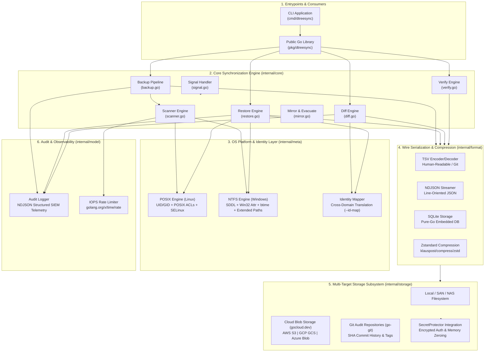
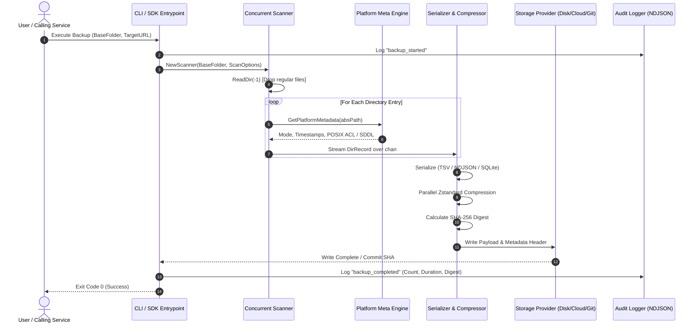
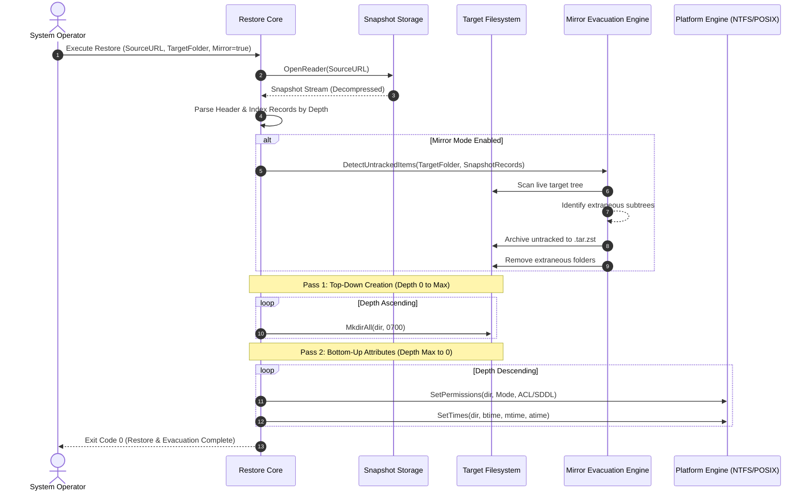
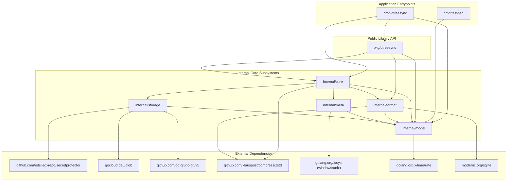
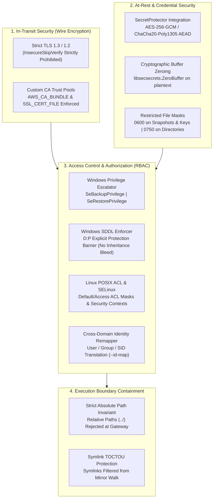

# dtreesync: Architecture and Technical Design Specification

**Target System:** Go 1.27.0+  
**Target Environments:** Linux (POSIX / glibc / SSSD / SELinux), Windows (NTFS / Active Directory / Win32)  
**Primary Domain:** Managed File Transfer (MFT) Infrastructure, Disaster Recovery (DR), and Compliance Auditing  
**Document Status:** Complete Architecture Specification

---

## 1. Architecture and Design Choices

### 1.1 Architectural Philosophy & Core Choices

[`dtreesync`](./) is engineered to solve a critical architectural challenge in high-throughput enterprise Managed File Transfer (MFT) gateways and distributed filesystem topologies: **synchronizing, preserving, diffing, and auditing multi-million directory structures without traversing or transferring payload files.**

```
+---------------------------------------------------------------------------------------------------------+
|                                      SYSTEM CORE PRINCIPLES                                             |
+------------------------------------+--------------------------------------+-----------------------------+
|        Zero File Payload I/O       |   Dual-Consumption Architecture      |     Forensic ACL Fidelity   |
| Discards regular files at the      | Production CLI ([cmd/dtreesync]) &   | Full POSIX ACL / xattrs &   |
| kernel boundary (f.ReadDir(-1))    | thread-safe library ([pkg/dtreesync])| Windows SDDL (D:P protected)|
+------------------------------------+--------------------------------------+-----------------------------+
|    Topological Depth Ordering      |   Multi-Engine Storage Abstraction   | Stream Integrity & Audit    |
| Top-down creation + bottom-up      | Local Disk, Cloud S3/GCS/Azure,      | SHA-256 payload digests,    |
| timestamp/ACL application          | and Git compliance repositories      | SIEM-ready NDJSON auditing  |
+------------------------------------+--------------------------------------+-----------------------------+
```

Key design decisions implemented throughout the architecture include:

1. **Dual-Consumption Model (CLI & Reusable Library):**
   The system provides two entrypoints sharing identical business logic:
   - **CLI Tool ([cmd/dtreesync](./cmd/dtreesync/main.go)):** Provides full command-line interfaces for backup, restore, diff, verify, and status commands with POSIX-compliant exit codes.
   - **Public Go SDK ([pkg/dtreesync](./pkg/dtreesync/api.go)):** Exposes idiomatic Go APIs ([Backup](./pkg/dtreesync/api.go#L35), [Restore](./pkg/dtreesync/api.go#L46), [Diff](./pkg/dtreesync/api.go#L57), [Verify](./pkg/dtreesync/api.go#L68), [Scan](./pkg/dtreesync/iter.go#L30)) utilizing Go 1.27 range-over-func iterators (`iter.Seq2[DirRecord, error]`) for embedding directly inside Kubernetes operators or microservices without spawning child processes.

2. **Zero File I/O (Syscall-Level Directory Filtration):**
   Conventional synchronization agents read entire directory structures, causing substantial I/O disk thrashing in directories with millions of payload files. `dtreesync` opens directories via batched directory reads (`f.ReadDir(-1)`) and drops non-directory entries immediately at the user-kernel boundary, maintaining near-zero CPU and memory overhead regardless of file volume.

3. **Topological Two-Pass Restoration:**
   Setting directory permissions and timestamps in random order causes parent timestamps to be overwritten whenever child subdirectories are created. `dtreesync` implements a two-pass algorithm:
   - **Pass 1 (Top-Down):** Recursively creates directory paths from root downward using safe staging permissions (`0o700`).
   - **Pass 2 (Bottom-Up):** Applies timestamps (`btime`, `mtime`, `atime`) and restrictive security descriptors (POSIX ACLs, SDDL) in reverse depth order (deepest directories first), guaranteeing that modifying parent directories never invalidates child timestamps.

4. **Multi-Format Wire Serialization:**
   Supports three self-contained wire formats:
   - **TSV (Tab-Separated Values):** Human-readable, git-friendly, tab-delimited records with a JSON metadata header envelope.
   - **NDJSON (Newline-Delimited JSON):** Line-oriented structured streaming format ideal for SIEM log shippers.
   - **SQLite (`.sqlite` / `.db`):** Pure-Go indexed database snapshots optimized for random-access queries and offline cataloging.
   - **Zstandard Compression (`.zst`):** Wire formats stream through parallel Zstandard compression stages via [`github.com/klauspost/compress/zstd`](./internal/format/compress.go).

5. **Strict Absolute Path Invariant:**
   To guarantee deterministic execution regardless of working directory, all input filesystem paths (`--base-folder`, `--tree-file`, `--target-folder`, `--log`, `--archive-extra-folder`) must be absolute. Relative paths (`./`, `../`) are rejected at the boundary ([model.ValidateAndCleanPath](./internal/model/path.go#L30)) with exit code `1`.

---

### 1.2 System Assumptions

1. **Filesystem Characteristics:** The underlying local storage supports standard filesystem metadata (NTFS on Windows; ext4, XFS, Btrfs, or ZFS on Linux).
2. **Time Synchronization:** Hosts maintain synchronized system clocks (via NTP/PTP) to ensure reliable drift detection across distributed environments.
3. **Identity Mapping Infrastructure:** Active Directory domains or POSIX SSSD/LDAP providers are accessible when resolving user/group identities; for offline migrations, static identity maps (`--id-map`) provide mapping tables.
4. **Cloud Storage Consistency:** S3-compatible endpoints, Google Cloud Storage, or Azure Blob Storage provide read-after-write consistency for snapshot files.
5. **Least-Privilege Process Execution:** The daemon or CLI process runs with appropriate read/write privileges (or acquires Win32 `SeBackupPrivilege`/`SeRestorePrivilege`).

---

### 1.3 Edge Cases & Mitigation Strategies

| Edge Case | Failure Mode / Risk | Architectural Mitigation Strategy |
| :--- | :--- | :--- |
| **Filesystem Mount Crossings** | Scanning crosses into external network shares or virtual filesystems (`/proc`, `/sys`, separate volumes). | `--one-file-system` enforces mount boundary confinement via `stat.Dev` matching on Linux and drive/UNC root checking on Windows ([isSameDevice](./internal/core/scanner_windows.go#L29)). |
| **Windows MAX_PATH (>260 Chars)** | Traditional Win32 APIs fail on deeply nested directories. | Transparently prefixes paths with `\\?\` using [ToExtendedWindowsPath](./internal/model/path.go#L91), unlocking 32,767 character paths. |
| **NSS/SSSD Death Spiral** | Resolving thousands of unknown UIDs/GIDs overwhelms LDAP/SSSD daemons. | Thread-safe in-memory caching for user and group name lookups shields NSS sockets from lookup exhaustion. |
| **Symlink TOCTOU & Directory Traversal** | Malicious symlinks attempt traversal escapes during restore or mirror operations. | Sanitizes paths via `filepath.Rel`, filters out symlinks prior to archive ingestion, and scopes file operations. |
| **Signal Interruption (SIGINT/SIGTERM)** | Process termination leaves partial corrupted archives or locked transactions. | [Two-tier signal handler](./internal/core/signal.go): First signal cancels context, drains worker queues within 500ms deadline, flushes compression and audit buffers, and exits code `1`. Second signal immediately hard kills. |
| **OOM on Constrained Containers** | High directory counts exhaust memory in cgroup-constrained environments. | Enforces runtime soft memory limit via `--max-memory-mb` ([debug.SetMemoryLimit](./cmd/dtreesync/main.go#L60)) and limits in-flight memory via fixed-capacity queues. |
| **Rate-Limit Throttling on SAN/NAS** | High scanner concurrency saturates storage controller IOPS. | Token-bucket rate limiter via `--max-iops` throttles filesystem syscall invocations cleanly. |

---

### 1.4 High-Level Architecture Diagram



---

## 2. Data Flow and Control Logic

### 2.1 Operational Flow

The operational flow of `dtreesync` spans five distinct command pipelines:

```
                  +-------------------------------------------------------------+
                  |                     COMMAND DISPATCH                        |
                  +-------------------------------------------------------------+
                                                 |
         +-------------------+-------------------+-------------------+-------------------+
         |                   |                   |                   |                   |
         v                   v                   v                   v                   v
     [ BACKUP ]          [ RESTORE ]          [ DIFF ]           [ VERIFY ]          [ STATUS ]
         |                   |                   |                   |                   |
         v                   v                   v                   v                   v
  1. Scan Dirs        1. Open Source      1. Scan Target      1. Stream Input     1. Read Headers
  2. Filter Files     2. Decompress       2. Load Snapshot    2. Decompress       2. Parse Metadata
  3. Extract Meta     3. Parse Header     3. Compare Sets     3. SHA-256 Check    3. Output Summary
  4. Stream Encoder   4. Pass 1: Top-Down 4. Generate Diff    4. Syntax Validate  4. Exit (Code 0)
  5. Compress Zstd       Create 0700      5. Output Format    5. Exit (0 or 4)
  6. Write Storage    5. Pass 2: Bottom-Up   (TSV/JSON/Text)
  7. Exit (Code 0)       Apply ACL/Time   6. Exit (0 or 3)
                      6. Exit (Code 0)
```

#### Detailed Stage Breakdown:

1. **Backup Flow:**
   - Evaluates source path, rate limits, and worker counts.
   - Launches concurrent workers scanning directories via `f.ReadDir(-1)`.
   - Populates [`model.DirRecord`](./internal/model/types.go#L37) containing normalized relative path and platform metadata.
   - Encodes records via TSV, NDJSON, or SQLite into a memory-spill hybrid buffer calculating streaming SHA-256 digest.
   - Emits compressed payload to local disk, cloud object storage, or commits directly to a Git repository.

2. **Restore Flow:**
   - Opens snapshot stream from local file or cloud bucket.
   - Reads header envelope, confirming format and compression scheme.
   - Streams directory records into memory and structures them into depth layers (`map[int][]model.DirRecord`).
   - Executes **Pass 1 (Top-Down)**: Creates directories with `0o700` mask.
   - Executes **Pass 2 (Bottom-Up)**: Reverses depth order ($D_{\text{max}} \to 0$), setting ownership, ACLs, SDDL, and nanosecond timestamps (`btime`, `mtime`, `atime`).

3. **Diff Flow:**
   - Loads baseline snapshot into an indexed lookup map.
   - Concurrently scans live target directory tree.
   - Compares directory records across 6 verification axes: existence, mode permissions, owner, group, timestamps, and extended ACLs.
   - Emits structured discrepancy reports: returns exit code `0` (clean match) or `3` (drift detected).

4. **Verify Flow:**
   - Decompresses snapshot stream on the fly without writing to disk.
   - Computes SHA-256 payload digest and checks against header `PayloadSHA256`.
   - Validates line syntax, timestamp formatting, and SQLite database integrity (`PRAGMA integrity_check`).
   - Returns exit code `0` (valid) or `4` (corrupted / verification failure).

---

### 2.2 Sequence Diagram: Backup Pipeline



---

### 2.3 Sequence Diagram: Restore & Mirror Evacuation



---

## 3. Performance and Scalability

### 3.1 Concurrency Model & Work-Stealing Pool

The core discovery engine ([internal/core/scanner.go](./internal/core/scanner.go)) utilizes a bounded worker pool governed by the host hardware profile:

$$\text{Workers} = \max\left(1, \min\left(N_{\text{CPU}} \times 2, 32\right)\right)$$

```
                                  [ Scanner Coordinator ]
                                             |
                  +--------------------------+--------------------------+
                  |                          |                          |
                  v                          v                          v
          [ Worker Goroutine 1 ]     [ Worker Goroutine 2 ]     [ Worker Goroutine N ]
                  |                          |                          |
                  +--------------------------+--------------------------+
                                             |
                                             v
                           [ chan model.DirRecord (Cap: 2048) ]
                                             |
                                             v
                              [ Serializer / Hybrid Buffer ]
                                             |
                                             v
                             [ Parallel Zstd Writer (4-32T) ]
```

1. **Lock-Free Counter Coordination:**
   Worker coordination and directory accounting use lockless typed atomics ([sync/atomic.Int64](./internal/core/scanner.go#L49)), avoiding global mutex serialization bottlenecks during high-throughput directory traversal.
2. **Channel-Based Decoupling:**
   Discovered records stream to serialization workers across buffered channels (`chan model.DirRecord`) with capacity clamped between 2,048 and 50,000 items, enabling the scanner to proceed uninterrupted without waiting on disk writes.
3. **Hybrid In-Memory / Spillover Buffering:**
   Payload serialization utilizes [`hybridBuffer`](./internal/core/backup.go#L365): payloads under 16MB reside strictly in memory; payloads exceeding 16MB spill transparently to a secure temporary file with `0o600` permissions. This bounds memory consumption to <20MB even when processing snapshots containing millions of directories.
4. **Range-over-Func Iterators (Go 1.27+):**
   The public SDK provides [dtreesync.Scan](./pkg/dtreesync/iter.go#L30), returning `iter.Seq2[DirRecord, error]` to allow consumers to process directories in a single memory-efficient `for ... := range` loop without slice allocations.

---

### 3.2 Channel Structures & Data Buffers

| Channel Name | Location | Type | Buffer Size | Purpose |
| :--- | :--- | :--- | :---: | :--- |
| `taskChan` | [internal/core/scanner.go](./internal/core/scanner.go#L112) | `chan scanTask` | Dynamic / Work-Stealing | Distributes subfolder scan jobs across concurrent worker pool. |
| `recordChan` | [internal/core/backup.go](./internal/core/backup.go#L115) | `chan model.DirRecord` | 2,048 | Decouples scanner producers from stream encoder consumers. |
| `auditQueue` | [internal/model/audit.go](./internal/model/audit.go#L43) | `chan AuditLogRecord` | 10,000 | Non-blocking telemetry ingestion queue streaming to SIEM log files. |
| `semChan` | [internal/core/restore.go](./internal/core/restore.go#L285) | `chan struct{}` | `workers` (1-32) | Worker throttling semaphore bounding parallel file attribute operations. |

---

## 4. Dependencies and Package Architecture

### 4.1 Dependency Catalog

The project adheres to a strict zero-bloat dependency philosophy:

| Module / Package | Direct / Indirect | Version | Architectural Responsibility |
| :--- | :---: | :---: | :--- |
| **`github.com/edsilegxrepo/secretprotector`** | Direct | `v0.0.4` | Zero-knowledge AEAD encrypted secret management, master key resolution, and buffer memory wiping (`ZeroBuffer`). |
| **`gocloud.dev`** | Direct | `v0.46.0` | Cloud-agnostic object storage driver streaming to AWS S3, Google Cloud Storage, and Azure Blob. |
| **`github.com/go-git/go-git/v5`** | Direct | `v5.19.2` | Pure-Go Git client used to commit snapshots, branch, and tag compliance histories. |
| **`github.com/go-git/go-billy/v5`** | Direct | `v5.9.1` | Virtual filesystem abstraction for in-memory and disk Git staging. |
| **`github.com/klauspost/compress`** | Direct | `v1.20.0` | High-throughput parallel Zstandard compression and streaming decompression. |
| **`golang.org/x/sys`** | Direct | `v0.48.0` | Direct OS platform syscall bindings: Windows Win32 security APIs and Linux POSIX xattr/SELinux headers. |
| **`golang.org/x/time`** | Direct | `v0.16.0` | Token-bucket rate limiter implementing dynamic IOPS governance (`--max-iops`). |
| **`modernc.org/sqlite`** | Direct | `v1.58.0` | Pure-Go (CGO-free) embedded SQLite engine enabling portable indexed snapshot querying on any host. |

---

### 4.2 Package Dependency Mermaid Chart



---

## 5. Security Architecture

### 5.1 Defense-in-Depth Security Matrix



### 5.2 Authentication Layers & Cloud Security

1. **Cloud Authentication:**
   - **AWS S3:** Authenticated via AWS IAM Role, Instance Metadata Service (IMDSv2), or SecretProtector-encrypted credentials in `AWS_ACCESS_KEY_ID` and `AWS_SECRET_ACCESS_KEY`.
   - **Google Cloud Storage (GCS):** Authenticated via Workload Identity or `GOOGLE_APPLICATION_CREDENTIALS`. If the credentials file is encrypted via SecretProtector, it is automatically decrypted in memory, spooled to an isolated `0o600` temporary file, and wiped immediately upon teardown.
   - **Azure Blob Storage:** Authenticated via Azure Managed Identity, Azure Key Vault, or encrypted connection strings.

2. **Git Repository Authentication:**
   - Supports SSH private keys with passphrase protection and HTTP Basic/PAT authentication. All passphrases and tokens can be supplied in encrypted form via SecretProtector and decrypted using master keys resolved from environment variables or secure key files.

3. **Wire Encryption Invariant:**
   - Disabling SSL validation (`InsecureSkipVerify = true`) is **strictly prohibited across all environments**. Production configurations strictly validate certificates against system trust stores or custom enterprise CA bundles specified via `AWS_CA_BUNDLE` or `SSL_CERT_FILE`.

### 5.3 Operating System Privilege Management

- **Windows Token Privilege Elevation:**
  To read and restore DACLs, system audit ACLs (SACLs), and ownership across restricted user trees, `dtreesync` dynamically opens the process token via `windows.OpenProcessToken` and enables:
  - `SeBackupPrivilege`: Bypasses file read security checks.
  - `SeRestorePrivilege`: Bypasses file write security checks and allows setting arbitrary file owners.
  - `SeSecurityPrivilege`: Enables reading and writing the SACL portion of security descriptors.

- **Explicit DACL Inheritance Protection (`D:P`):**
  When writing Windows Security Descriptors, `dtreesync` enforces the protected DACL flag (`D:P`). This prevents parent directory ACLs from unintentionally overriding restored security boundaries, guaranteeing exact security parity.

- **Linux Extended Attributes & SELinux:**
  Captures and restores full extended attribute namespaces (`user.*`, `trusted.*`, `security.*`) including `security.selinux`. When restoring across distinct security contexts, identity maps ([internal/model/idmap.go](./internal/model/idmap.go)) translate user IDs, group IDs, and ACL user strings without triggering SSSD NSS bottlenecks.
