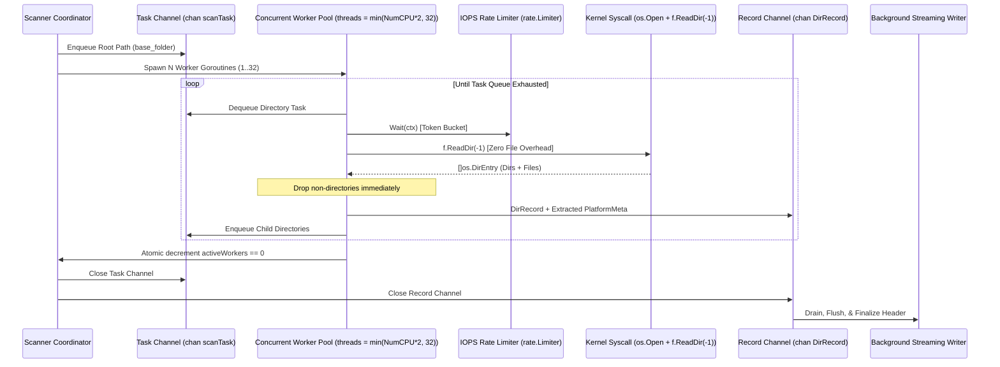
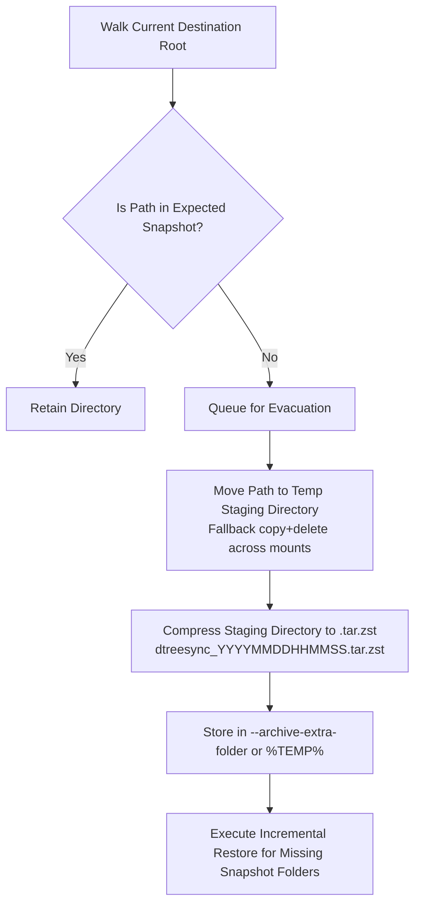
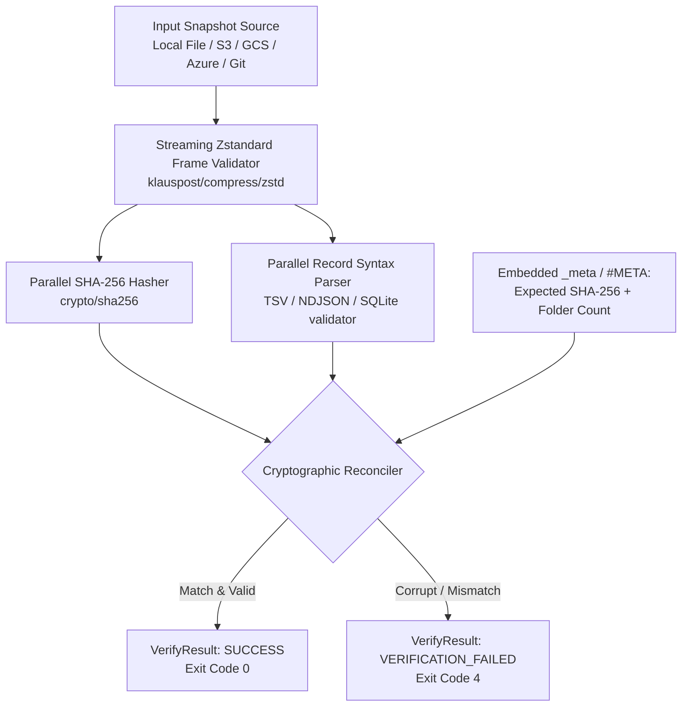
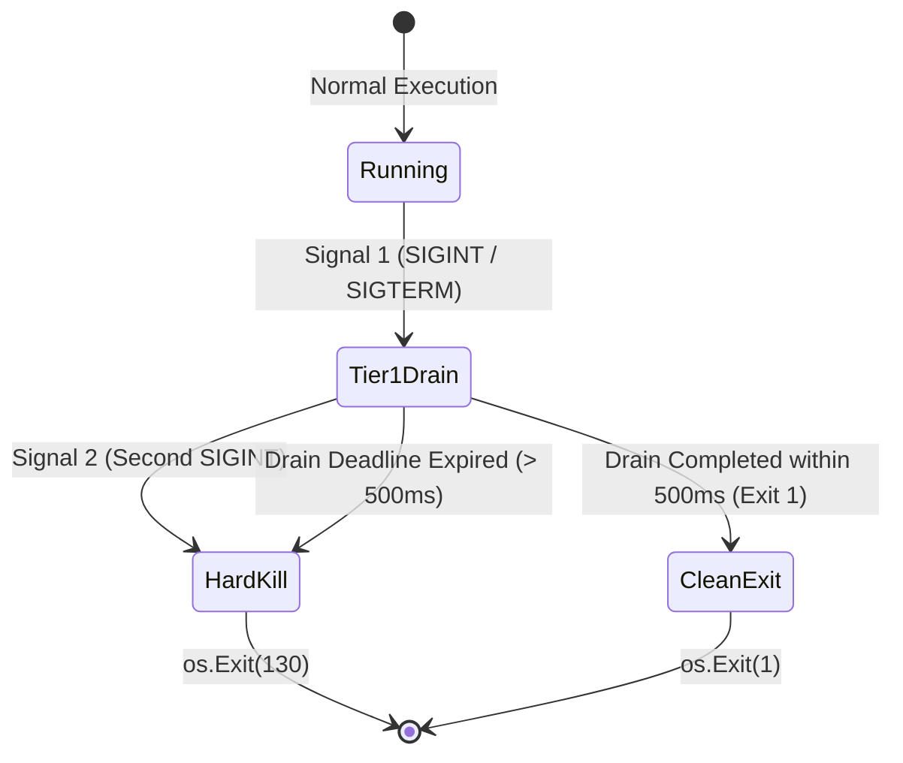

# dtreesync: High-Scale Directory Tree Synchronization & Compliance Specification

**Document Version:** 1.0.0  
**Target System:** Go 1.27.0+  
**Target Environments:** Linux (POSIX / glibc / SSSD / SELinux), Windows (NTFS / Active Directory)  
**Primary Domain:** Managed File Transfer (MFT) Infrastructure, Disaster Recovery (DR), and Compliance Auditing  

---

## Documentation Roadmap & Cross-References

`DESIGN.md` serves as the detailed technical specification for internal subsystem architectures, memory layout, data structures, and wire format specifications. Related documentation includes:

- **[Operational Guide & CLI Manual (`README.md`)](./README.md)**: User-facing CLI flag catalog, exit codes, security and vulnerability reviews, operational usage examples, and production deployment manifests (Systemd, Kubernetes).
- **[Architecture & Technical Design (`ARCHITECTURE.md`)](./ARCHITECTURE.md)**: Architectural philosophy, two-pass topological restoration algorithms, Mermaid sequence diagrams, memory/concurrency models, and security RBAC flowcharts.
- **[Test Suite & Verification (`TESTING.md`)](./TESTING.md)**: Test harness architecture, positive/negative test catalog, live Docker MinIO integration, statement coverage metrics (84.1%), and troubleshooting.
- **[Changelog & Version History (`CHANGELOG.md`)](./CHANGELOG.md)**: Release notes, version history, and milestone deliverables.

---

## 1. Executive Summary & System Philosophy

### 1.1 Problem Statement
Enterprise Managed File Transfer (MFT) gateways (e.g., Axway SecureTransport, IBM Sterling, Globalscape EFT, GoAnywhere) and high-throughput SFTP/FTPS/AS2 landing arrays continuously process petabytes of transient, ephemeral files. While payload files have lifetimes ranging from minutes to days before being ingested and purged, the underlying directory mesh represents **permanent, business-critical contractual infrastructure**:
- Partner mailboxes (`/mft/landing/{partner_id}/{inbound,outbound,archive,errors}`).
- Strict tenant isolation boundaries, virtual chroot jails, and distinct POSIX / NTFS ACL masks.
- Complex inheritance structures and owner/group security identifiers.

Traditional filesystem backup utilities (e.g., standard `tar`, `rsync`, enterprise snapshot agents) are poorly suited for this domain:
1. **Payload Overhead:** Traversing billions of ephemeral payload files during a directory snapshot produces severe disk I/O bottlenecks and bloats backup repositories.
2. **Metadata Loss:** Standard tools often strip extended attributes (`xattrs`), default POSIX ACLs, SELinux security contexts, or Windows Security Descriptors (SDDL).
3. **Identity System Bottlenecks:** Naive metadata queries against enterprise directory services (Active Directory, FreeIPA, OpenLDAP, SSSD) flood NSS sockets, triggering the "NSS Death Spiral."
4. **Compliance & Audit Gaps:** Auditors require cryptographic proof of directory permissions, non-repudiation, and granular change logs without capturing customer payload data.

### 1.2 System Purpose
`dtreesync` is a dedicated, high-performance Go synchronization engine engineered as both a standalone CLI utility and a reusable, idiomatic Go library (`pkg/dtreesync`). It snapshots, restores, mirrors, and audits large-scale directory structures (millions of nodes) with zero payload file I/O. It guarantees exact cross-platform permission fidelity across Linux and Windows, integrates natively with cloud object storage and Git-based audit repositories, and operates safely inside high-churn MFT production arrays.

### 1.3 Core Architectural Tenets

The design of `dtreesync` centers on seven core architectural principles:
1. **Dual-Consumption Architecture:** Standalone CLI tool (`cmd/dtreesync`) and reusable Go library (`pkg/dtreesync`) sharing the same core engine.
2. **Zero File Payload I/O:** Syscall-level directory filtration (`f.ReadDir(-1)` and Linux `unix.Getdents64`), discarding regular files at the kernel boundary.
3. **Forensic Identity & ACL Fidelity:** Captures POSIX ACLs, SELinux contexts, and Windows NTFS SDDL with explicit `D:P` protection and birth times (`btime`).
4. **Topological Two-Pass Restoration:** Top-down directory creation followed by bottom-up reverse-depth attribute/timestamp application ($D_{\max} \to 0$).
5. **Streaming Serialization Pipeline:** Canonical TSV, NDJSON, and SQLite formats backed by multi-threaded Zstandard compression.
6. **Strict Execution Guardrails:** Kernel sandboxing (`os.OpenRoot`), absolute path invariant, token-bucket IOPS rate limiting, and two-tier signal traps.
7. **Multi-Engine Storage Abstraction:** Direct streaming to local disk, AWS S3 / GCS / Azure Blob (`gocloud.dev`), and in-memory Git compliance commits (`go-git`).

> [!NOTE]
> For the comprehensive architectural breakdown of each core principle, design rationale, and edge-case mitigations, see **[`ARCHITECTURE.md` § 1.1 (Architectural Philosophy & Core Choices)](./ARCHITECTURE.md#11-architectural-philosophy--core-choices)**.

---

## 2. High-Level Architecture

The `dtreesync` synchronization architecture is structured across six primary operational subsystems:
1. **Entrypoints & Consumers:** Production CLI (`cmd/dtreesync`) and embeddable Go library API (`pkg/dtreesync`).
2. **Core Discovery Engine:** Producer-consumer concurrent directory traversal (`internal/core/scanner.go`).
3. **OS Platform Engine:** Linux POSIX ACLs, SSSD caches, SELinux, and Windows NTFS SDDL privilege management (`internal/meta/`).
4. **Wire Serialization & Compression:** Canonical TSV, NDJSON, and SQLite formats backed by multi-threaded Zstandard compression (`internal/format/`).
5. **Storage Subsystems:** Local filesystem, cloud blob storage (AWS S3, GCP GCS, Azure Blob), and Git compliance stores (`internal/storage/`).
6. **Observability & Guardrails:** SIEM-ready NDJSON audit streaming, soft memory limits, and token-bucket IOPS rate limiting.

> [!NOTE]
> For the authoritative high-level architectural flowchart and subsystem interaction diagrams, see **[`ARCHITECTURE.md` § 1.4 (High-Level Architecture Diagram)](./ARCHITECTURE.md#14-high-level-architecture-diagram)**. For operational data flow pipelines and sequence diagrams, see **[`ARCHITECTURE.md` § 2 (Data Flow and Control Logic)](./ARCHITECTURE.md#2-data-flow-and-control-logic)**.

---

## 3. Command-Line Interface (CLI) Specification

`dtreesync` provides five core production subcommands:
- `backup`: Traverses directory hierarchies without reading payload files, compiling compressed snapshots to disk, cloud, or Git.
- `restore`: Reconstitutes directory structures with topological two-pass bottom-up attribute preservation and mirror evacuation.
- `diff`: Non-destructively compares live filesystem structures against snapshots, returning structured drift telemetry.
- `status` (alias: `inspect`): Peeks snapshot headers in microseconds without decompressing payloads.
- `verify`: Performs zero-disk-write cryptographic integrity verification against SHA-256 payload checksums and Zstandard frames.

> [!NOTE]
> Detailed user-facing CLI flag catalogs, parameter types, default values, process exit codes (`0` to `5`), and production invocation examples are maintained in the operational manual:
> - **[CLI Arguments & Exit Codes Matrix (`README.md` § 4)](./README.md#4-command-line-arguments)**
> - **[Production Usage & Deployment Scenarios (`README.md` § 5)](./README.md#5-detailed-usage--deployment-examples)**

---

## 4. Data Models & Wire Format Specifications

### 4.1 Go In-Memory Structs

```go
package dtreesync

import (
    "time"
)

// BackupMetadata defines the self-contained audit header embedded in every snapshot.
type BackupMetadata struct {
    Version      string    `json:"version"`                 // Schema specification version (e.g. "2.0")
    BaseFolder   string    `json:"base_folder"`             // Canonical source base path
    Entity       string    `json:"entity,omitempty"`       // Filtered entity or empty for all
    CreatedAt    time.Time `json:"created_at"`              // Snapshot creation timestamp in UTC
    FolderCount  int64     `json:"folder_count"`            // Total directory nodes recorded
    TreeFile     string    `json:"tree_file"`               // Output artifact name
    TreeFormat   string    `json:"tree_format"`             // Serialization engine: "tsv", "ndjson", "sqlite"
    Compression  bool      `json:"compression"`             // Zstandard compression flag
    HostOS       string    `json:"host_os"`                 // runtime.GOOS ("linux" or "windows")
    Hostname     string    `json:"hostname"`                // FQDN or hostname of scanner node
    PayloadSHA256 string   `json:"payload_sha256,omitempty"`// SHA-256 hash of uncompressed data payload
}

// PlatformMeta encapsulates cross-platform filesystem permissions and security attributes.
type PlatformMeta struct {
    // POSIX / Enterprise Linux (NSS, SSSD, PAM, Kerberos, OpenLDAP)
    UID           *uint32 `json:"uid,omitempty"`            // Numeric POSIX User ID
    GID           *uint32 `json:"gid,omitempty"`            // Numeric POSIX Group ID
    Username      string  `json:"username,omitempty"`       // Canonical name (e.g. alice@corp.local)
    Group         string  `json:"group,omitempty"`          // Canonical group (e.g. domain admins@corp.local)
    Mode          *uint32 `json:"mode,omitempty"`           // Standard chmod bitmask (e.g. 0755, 02775)
    ACLAccess     string  `json:"acl_access,omitempty"`     // Hex-encoded binary system.posix_acl_access
    ACLDefault    string  `json:"acl_default,omitempty"`    // Hex-encoded binary system.posix_acl_default
    ACLText       string  `json:"acl_text,omitempty"`       // Canonical portable POSIX text representation (getfacl format)
    SELinuxContext string `json:"selinux,omitempty"`        // Raw string security.selinux context

    // Windows NTFS / Active Directory
    OwnerSID       string  `json:"owner_sid,omitempty"`      // Owner Security Identifier (e.g. S-1-5-21-...)
    GroupSID       string  `json:"group_sid,omitempty"`      // Primary Group Security Identifier
    OwnerName      string  `json:"owner_name,omitempty"`     // DOMAIN\User account string
    GroupName      string  `json:"group_name,omitempty"`     // DOMAIN\Group account string
    SDDL           string  `json:"sddl,omitempty"`           // Security Descriptor Definition Language string (with D:P)
    FileAttributes *uint32 `json:"file_attrs,omitempty"`     // Win32 bitmask (Hidden, ReadOnly, System, etc.)

    // Timestamps
    BirthTime      int64   `json:"btime,omitempty"`          // Epoch nanoseconds of creation time (NTFS btime)
    ModTime        int64   `json:"mtime"`                    // Epoch nanoseconds of modification time
    AccessTime     int64   `json:"atime,omitempty"`          // Epoch nanoseconds of access time
    ChangeTime     int64   `json:"ctime,omitempty"`          // Epoch nanoseconds of metadata change time
}

// DirRecord represents a single discovered directory in the snapshot stream.
type DirRecord struct {
    Entity   string       `json:"entity"`   // Immediate root subfolder (partner ID) or assigned entity
    RelPath  string       `json:"rel_path"` // Normalized relative path using forward slashes ("/")
    Metadata PlatformMeta `json:"meta"`     // Platform-specific security descriptors and timestamps
}

// NDJSONHeader defines Line 1 of an NDJSON (.jsonl) snapshot stream.
type NDJSONHeader struct {
    Meta BackupMetadata `json:"_meta"`
}

// TreePayload defines legacy single-document JSON envelope (if raw array requested).
type TreePayload struct {
    Metadata BackupMetadata `json:"metadata"`
    Records  []DirRecord    `json:"records"`
}

// AuditLogRecord represents a single machine-readable NDJSON entry emitted to --log <file>.
type AuditLogRecord struct {
    Timestamp time.Time      `json:"timestamp"`          // RFC3339 timestamp in UTC
    Level     string         `json:"level"`              // Severity: "INFO", "WARN", "ERROR", "AUDIT"
    Subsystem string         `json:"subsystem"`          // "scanner", "restore", "mirror", "diff", "retention", "verify"
    Event     string         `json:"event"`              // Lifecycle event: "job_start", "dir_scanned", "dir_created", "perm_applied", "drift_detected", "evacuated", "verify_pass", "verify_fail", "job_complete"
    Path      string         `json:"path,omitempty"`     // Sanitized absolute path
    Details   map[string]any `json:"details,omitempty"`  // Contextual telemetry metrics
    Error     string         `json:"error,omitempty"`    // Error message if level is WARN or ERROR
}

// IdentityMap specifies translation tables for migrating across domains, accounts, or UID/GID spaces.
type IdentityMap struct {
    Users     map[string]string `json:"users,omitempty"`     // Source username -> Target username (e.g. "alice@old.local": "alice@new.local")
    Groups    map[string]string `json:"groups,omitempty"`    // Source groupname -> Target groupname
    UIDs      map[uint32]uint32 `json:"uids,omitempty"`      // Source numeric UID -> Target numeric UID
    GIDs      map[uint32]uint32 `json:"gids,omitempty"`      // Source numeric GID -> Target numeric GID
    SIDs      map[string]string `json:"sids,omitempty"`      // Source Windows SID -> Target Windows SID
}

// VerifyResult encapsulates the outcome of a zero-disk-write cryptographic stream verification.
type VerifyResult struct {
    TreeFile       string        `json:"tree_file"`
    Format         string        `json:"format"`
    Compression    bool          `json:"compression"`
    RecordCount    int64         `json:"record_count"`
    PayloadSHA256  string        `json:"payload_sha256"`
    ExpectedSHA256 string        `json:"expected_sha256,omitempty"`
    ChecksumValid  bool          `json:"checksum_valid"`
    FramesValid    bool          `json:"frames_valid"`
    SyntaxValid    bool          `json:"syntax_valid"`
    Duration       time.Duration `json:"duration"`
    Errors         []string      `json:"errors,omitempty"`
}
```

#### 4.1.1 High-Density Memory Optimization via `unique.Handle` (Go 1.23+)
In enterprise MFT topologies containing millions of directories, string fields such as entity/partner names (`"partner_walmart"`), leaf names (`"inbound"`, `"outbound"`, `"archive"`), domain accounts (`"CORP\\mft_svc"`), and SELinux contexts are duplicated hundreds of thousands of times.
- **Canonical Interning:** The scanner interns repetitive tokens using the standard library's `unique.Make(val)`.
- **Heap Compression:** Storing `unique.Handle[string]` collapses duplicate heap strings down to single canonical instances, reducing memory overhead from ~25MB down to <10MB across 1M+ folders.
- **$O(1)$ Equality Checks:** Entity filtering (`h1 == h2`) executes via single pointer comparison rather than byte-by-byte string walks.

---

### 4.2 Serialization Format Specifications

#### 4.2.1 Format 1: TSV (Canonical Compliance & High Performance)
TSV is the recommended format for large production directories (lowest memory footprint, fastest write speed, native Git diffability).
- **Encoding:** UTF-8, line-delimited (`\n`), tab-separated (`\t`).
- **Header Structure:** Embedded `#META:` JSON metadata envelope as line 1, followed by human-readable comment headers and the canonical column layout.
- **Null Value Representation:** Hyphen `-` represents null or empty string fields.
- **Canonical Sorting:** In Git compliance mode, records **must** be lexicographically sorted by `rel_path` prior to flushing.

```tsv
#META:{"base_folder":"/var/mft/landing","entity":"","created_at":"2026-09-11T17:55:00Z","folder_count":4502,"tree_file":"landing_tree.tsv","tree_format":"tsv","compression":false,"host_os":"linux","hostname":"mft-gw-01.corp.internal","payload_sha256":"7f83b1657ff1fc53b92dc18148a1d65dfc2d4b1fa3d677284addd200126d9069"}
# COMPLIANCE AUDIT RECORD: dtreesync
# SOURCE_BASE: /var/mft/landing
# TIMESTAMP_UTC: 2026-09-11T17:55:00Z
entity	rel_path	mode	uid	gid	user	group	acl_access	acl_default	selinux	sddl	attrs	mtime
walmart	walmart	0750	1001	1001	walmart_svc	mft_users	020000000100...	020000000100...	system_u:object_r:mft_data_t:s0	-	0	1789145700000000000
walmart	walmart/inbound	0770	1001	1001	walmart_svc	mft_users	020000000100...	020000000100...	system_u:object_r:mft_data_t:s0	-	0	1789145700000000000
walmart	walmart/outbound	0750	1001	1001	walmart_svc	mft_users	-	-	system_u:object_r:mft_data_t:s0	-	0	1789145700000000000
```

#### 4.2.2 Format 2: NDJSON / JSON Lines (High-Throughput Streaming & Git Compliance)
Rather than wrapping all records in an unbounded single-document JSON array (`{"records": [...]}`), `dtreesync` employs **Newline Delimited JSON (NDJSON / `.jsonl`)**:
- **Line 1 (Self-Contained Audit Header):** The first line contains the metadata envelope object `{"_meta": {...}}`. The `status` command reads this single line in microseconds via `bufio.Reader` without parsing downstream records.
- **Lines 2+ (One JSON Object Per Directory):** Each subsequent line contains an independent, valid JSON representation of a `DirRecord`.
- **Parallel Stream Decoding:** During restore, a coordinator scans line boundaries (`\n`) and fans out byte slices across worker goroutines for concurrent `json.Unmarshal`, completely bypassing the single-threaded bottleneck of standard sequential `json.Decoder.Token()`.
- **Atomic Git Diffs:** Adding, modifying, or removing a directory alters exactly one line in the Git audit repository without comma or closing-bracket syntax side effects.

```json
{"_meta":{"base_folder":"C:\\MFT\\Landing","entity":"partner_target","created_at":"2026-09-11T17:55:00Z","folder_count":128,"tree_file":"target.jsonl.zst","tree_format":"ndjson","compression":true,"host_os":"windows","hostname":"MFT-WIN-NODE01"}}
{"entity":"partner_target","rel_path":"partner_target","meta":{"owner_sid":"S-1-5-21-3623811015-3361044348-30300820-1013","group_sid":"S-1-5-21-3623811015-3361044348-30300820-513","owner_name":"CORP\\target_svc","group_name":"CORP\\MFT_Users","sddl":"O:S-1-5-21...G:S-1-5-21...D:P(A;OICI;FA;;;S-1-5-21...)","file_attrs":2,"mtime":1789145700000000000}}
{"entity":"partner_target","rel_path":"partner_target/inbound","meta":{"owner_sid":"S-1-5-21-3623811015-3361044348-30300820-1013","group_sid":"S-1-5-21-3623811015-3361044348-30300820-513","owner_name":"CORP\\target_svc","group_name":"CORP\\MFT_Users","sddl":"O:S-1-5-21...G:S-1-5-21...D:P(A;OICI;FA;;;S-1-5-21...)","file_attrs":2,"mtime":1789145700000000000}}
```

#### 4.2.3 Format 3: SQLite (Relational Querying & Embedded Analytics)
Implemented via pure Go driver `modernc.org/sqlite` (no CGO required for SQLite engine).
- **SQLite Pragma Tuning:**
  `PRAGMA synchronous = OFF;`  
  `PRAGMA journal_mode = MEMORY;`  
  `PRAGMA cache_size = -64000;` (64MB RAM page cache)
- **Batched Transaction Commits (50,000 Rows):** To eliminate per-insert transaction disk overhead, inserters stream records in explicit transactions, committing every 50,000 rows (`count % 50000 == 0`) before creating indices on completion.
- **Schema Specification:**
```sql
CREATE TABLE IF NOT EXISTS metadata (
    base_folder   TEXT NOT NULL,
    entity        TEXT,
    created_at    DATETIME NOT NULL,
    folder_count  INTEGER NOT NULL,
    tree_file     TEXT NOT NULL,
    tree_format   TEXT NOT NULL,
    compression   BOOLEAN NOT NULL,
    host_os       TEXT NOT NULL,
    hostname      TEXT NOT NULL,
    payload_sha256 TEXT
);

CREATE TABLE IF NOT EXISTS directories (
    id         INTEGER PRIMARY KEY AUTOINCREMENT,
    entity     TEXT NOT NULL,
    rel_path   TEXT NOT NULL UNIQUE,
    meta_json  TEXT NOT NULL
);

CREATE INDEX IF NOT EXISTS idx_directories_entity ON directories(entity);
CREATE INDEX IF NOT EXISTS idx_directories_relpath ON directories(rel_path);
```

---

## 5. Subsystem Detailed Specifications

### 5.1 Concurrent Discovery Subsystem (Producer-Consumer Engine)

Standard recursive directory traversals (`filepath.Walk`, `filepath.WalkDir`) suffer from major throughput limits on multi-million folder trees due to single-threaded metadata serialization and recursion overhead. `dtreesync` employs an asynchronous work-stealing producer-consumer pipeline.



#### 5.1.1 Concurrency & Work Pool Mechanics
1. **Hierarchical Work-Stealing & Bounded Threading:** Rather than enqueueing individual child directories, workers package discovered subdirectories into batches (`scanTaskBatch`). Workers prioritize recursing into the first 3-4 directory levels locally within the thread's CPU cache before dispatching sibling batches to `taskChan`. Concurrency defaults to `min(runtime.NumCPU() * 2, 32)` and is clamped strictly between 1 and 32 threads (`1 <= threads <= 32`), eliminating channel lock contention and thread oversubscription.
2. **Typed Atomic Worker Tracking:** Uses typed `sync/atomic.Int64` (`var activeWorkers atomic.Int64`) with `activeWorkers.Add(1)` and `activeWorkers.Add(-1) == 0` for lockless coordination without memory alignment pitfalls.
3. **Linux Kernel Fast-Path (`unix.Getdents64`):** On Linux, the scanner directly executes `unix.Getdents(fd, buf)` using a stack/pooled 64KB buffer, bypassing `os.File` and `os.DirEntry` allocations. On Windows, it uses batched `os.Open` + `f.ReadDir(-1)`.
4. **Zero-Allocation Buffer Pools (`sync.Pool`):** Reusable byte slice scratch buffers from `pathPool` construct relative paths and perform in-place separator replacements, eliminating tens of millions of transient string heap allocations.
5. **Symlink, Junction, and Reparse Point Immunity:** Uses `os.Lstat` on each discovered folder. On Windows, directory junctions (e.g., `C:\Users\Default\Application Data -> AppData\Local`) and reparse points are verified against `windows.FILE_ATTRIBUTE_REPARSE_POINT` (0x400) and `mode & os.ModeSymlink != 0`. Traversal into junction loops and circular symlinks is strictly bypassed, preventing runaway recursion.
6. **Filesystem Boundary Guard (`--one-file-system`):** At scanner initialization, executes `os.Stat(baseFolder)`. On Linux, extracts `stat.Dev` from `fi.Sys().(*syscall.Stat_t).Dev`. For every child directory visited, checks `childStat.Dev == rootDev`. If unequal, the entire submount is skipped (`filepath.SkipDir`).
7. **Glob Pattern Matching (`--include`, `--exclude`):** Discovered relative paths are evaluated against compiled `path/filepath.Match` and recursive glob matchers before metadata extraction. Excluded paths (e.g. `**/.snapshot/**`, `**/lost+found/**`) are pruned immediately with `filepath.SkipDir`.
8. **Real-Time Terminal Progress & Telemetry (`--progress`):** When running on an interactive TTY, a background 10Hz ticker outputs a non-blocking terminal telemetry line showing directories scanned, current rate (dirs/sec), active RSS memory, and the active path head.
9. **Zero-Allocation Stream Iterators (`iter.Seq`):** Exposes `iter.Seq[DirRecord]` range-over-func iterators for internal pipelines, eliminating channel context-switch overhead during local stage batching.
10. **Multi-Threaded Compression Optimization:** The streaming Zstandard compressor is initialized with `zstd.WithEncoderConcurrency(min(runtime.NumCPU(), 32))` backed by a 1MB `bufio.Writer` buffer, ensuring compression throughput keeps pace with multi-core directory discovery.
11. **Dynamic IOPS Rate Limiting (`--max-iops`):** When `--max-iops <N>` is configured (default `0` = unlimited), filesystem operations pass through a token-bucket rate limiter (`golang.org/x/time/rate.NewLimiter(rate.Limit(maxIOPS), burstSize)`). This prevents `dtreesync` from saturating shared SAN/NAS arrays or triggering cloud storage IOPS throttling during peak business hours.

---

### 5.2 Enterprise Identity & Platform Metadata Subsystem

#### 5.2.1 Linux / POSIX Metadata & NSS Death Spiral Mitigation
When querying user and group identities across millions of directory nodes in enterprise Linux systems integrated with LDAP, Active Directory, or FreeIPA via SSSD, naive standard library calls (`user.LookupId`) saturate the `/var/lib/sss/pipes/nss` Unix domain socket. This leads to connection timeouts, hung goroutines, and SSSD crashes.

```mermaid
flowchart LR
    ScanWorker[Scanner Worker] --> CacheCheck{In-Memory Cache\nsync.Map}
    CacheCheck -- Hit --> ReturnID[Return Cached Username/Group]
    CacheCheck -- Miss --> CGO["CGO glibc Call\n(getpwuid_r / getgrgid_r)"]
    CGO --> NSS[/etc/nsswitch.conf]
    NSS --> SSSD[sssd daemon / local cache]
    SSSD --> Remote[Active Directory / LDAP]
    SSSD -- Response --> StoreCache[Store in sync.Map]
    StoreCache --> ReturnID
```

##### 1. Mandatory CGO Compilation
Go binaries compiled with `CGO_ENABLED=0` bypass `/etc/nsswitch.conf` and parse `/etc/passwd` directly. Because enterprise SSO accounts are not written to `/etc/passwd`, `CGO_ENABLED=1` is **mandatory** for production Linux builds to dynamically link against `libc.so.6` and access `libnss_sss.so.2` and `libnss_winbind.so.2`.

##### 2. High-Performance Identity Caching
Maintains four global, concurrent-safe `sync.Map` lookup caches:
```go
var (
    uidToNameCache sync.Map // uint32 -> string
    gidToNameCache sync.Map // uint32 -> string
    nameToUIDCache sync.Map // string -> int
    nameToGIDCache sync.Map // string -> int
)
```

##### 3. Algorithmic ID Mapping Resolution
SSSD environments often deploy algorithmic UID mapping (`ldap_id_mapping = true`), causing identical users to receive different numeric UIDs across different Linux hosts. On restore, `dtreesync` employs the following priority resolution:
1. Attempt canonical username lookup via NSS (`user.Lookup(meta.Username)`).
2. If NSS succeeds, use the host's local mapped UID.
3. If username lookup fails or network directory is unreachable, fall back to the recorded numeric `meta.UID`.
4. Apply identical fallback logic for group GIDs.

##### 4. Hybrid POSIX ACLs & SELinux Extraction
- **Access ACLs:** Read via `unix.Getxattr(path, "system.posix_acl_access", buf)` and persisted as hex-encoded binary strings.
- **Default ACLs:** Directories have an inheritable template ACL read via `unix.Getxattr(path, "system.posix_acl_default", buf)` and persisted as hex-encoded binary strings.
- **Canonical Symbolic Text ACLs (`ACLText`):** Persisted alongside binary xattrs (e.g., `u:alice:rwx,g:finance:r-x,m::rwx`). When restoring onto systems where algorithmic SSSD UID mapping assigns different numeric UIDs to identical domain accounts, `dtreesync` prioritizes parsing symbolic entries and resolving current target host UIDs via NSS, falling back to raw binary xattrs only if NSS resolution is unavailable.
- **SELinux Contexts:** Read via `unix.Getxattr(path, "security.selinux", buf)` and stored as a raw string (e.g., `system_u:object_r:mft_data_t:s0`).

##### 5. Non-Root / Unprivileged Execution Degradation (`CAP_CHOWN`)
Reassigning file and directory ownership on Linux requires superuser privileges or the `CAP_CHOWN` capability. If `dtreesync restore` is executed by an unprivileged system user, `os.Chown` fails with `EPERM`. The engine catches this error non-fatally, logs an operational warning (`[WARN] Chown denied on <path>: executing without CAP_CHOWN; retaining current process user`), preserves directory creation and permissions, and marks execution with exit code `2` (`PARTIAL_WARNING`).

---

#### 5.2.2 Windows NTFS Subsystem

##### 1. Extended-Length Path Normalization (`\\?\` UNC)
Classic Win32 API calls crash or fail silently when total path lengths exceed 260 characters (`MAX_PATH`). `dtreesync` intercepts all Windows paths before issuing syscalls and applies UNC prefix normalization:
- Local drive paths: `C:\path\to\dir` $\to$ `\\?\C:\path\to\dir`
- Network SMB shares: `\\server\share\dir` $\to$ `\\?\UNC\server\share\dir`

```go
func fixLongPath(path string) string {
    cleaned := filepath.Clean(path)
    if strings.HasPrefix(cleaned, `\\?\`) {
        return cleaned
    }
    if strings.HasPrefix(cleaned, `\\`) {
        return `\\?\UNC\` + strings.TrimPrefix(cleaned, `\\`)
    }
    if !filepath.IsAbs(cleaned) {
        cleaned, _ = filepath.Abs(cleaned)
    }
    return `\\?\` + cleaned
}
```

##### 2. NT Process Privilege Escalation
Accessing Windows System Access Control Lists (SACL audit rules) or assigning directory ownership requires specific NT privileges. Without programmatic privilege elevation, `SetNamedSecurityInfoW` aborts with `ERROR_PRIVILEGE_NOT_HELD` (Win32 Error 1314).
Prior to executing backup or restore routines, `dtreesync` acquires:
- `SeBackupPrivilege`: Bypasses NTFS read ACL checks to guarantee complete tree inspection.
- `SeRestorePrivilege`: Bypasses write permissions and allows assigning arbitrary owner SIDs.
- `SeSecurityPrivilege`: Permits reading and writing SACL audit entries.

##### 3. SDDL (Security Descriptor Definition Language) Extraction
Interacts directly with `advapi32.dll` via syscalls:
1. `GetNamedSecurityInfoW`: Fetches security descriptor pointer (`pSD`) capturing `OWNER_SECURITY_INFORMATION | GROUP_SECURITY_INFORMATION | DACL_SECURITY_INFORMATION`.
2. `ConvertSecurityDescriptorToStringSecurityDescriptorW`: Serializes the security descriptor into canonical SDDL text with explicit/non-inherited entries preserved (e.g., `O:S-1-5-21...G:S-1-5-21...D:P(A;OICI;FA;;;S-1-5-21...)`). The `D:P` (`SE_DACL_PROTECTED`) control flag is explicitly preserved so parent drive permissions never overwrite partner isolation boundaries upon restoration.
3. Extracts Win32 file attribute bitmask using `windows.GetFileAttributes` and masks out `FILE_ATTRIBUTE_DIRECTORY` (0x10) to store non-inherited intent (Hidden, ReadOnly, System, Archive).

##### 4. Atomic Windows Timestamps (`btime`, `mtime`, `atime`) via `SetFileTime`
Standard `os.Chtimes` only updates access and modification timestamps, ignoring creation time (`btime`). On Windows, `dtreesync` opens directory handles with `windows.FILE_FLAG_BACKUP_SEMANTICS` and executes `windows.SetFileTime(handle, &creationTime, &accessTime, &writeTime)` to restore birth times atomically for absolute forensic fidelity.

#### 5.2.3 Cross-Domain Identity Translation Subsystem (`--id-map <file>`)

During enterprise migrations—such as consolidating Active Directory forests, lifting on-premises workloads to AWS/Azure/GCP, or synchronizing between heterogeneous Linux clusters with differing SSSD/NSS UID ranges—recorded identities in snapshots cannot be applied verbatim to target hosts.

The `--id-map <file>` flag provides a declarative JSON identity translation table:

```json
{
  "users": {
    "alice@legacycorp.local": "alice@newcorp.com",
    "mft_svc_prod": "mft_svc_stage"
  },
  "groups": {
    "mft_admins@legacycorp.local": "mft_admins@newcorp.com",
    "legacy_partners": "cloud_partners"
  },
  "uids": {
    "10042": 20042,
    "10050": 20050
  },
  "gids": {
    "5001": 6001
  },
  "sids": {
    "S-1-5-21-1111111111-2222222222-3333333333-1001": "S-1-5-21-9999999999-8888888888-7777777777-2001"
  }
}
```

##### 1. Identity Translation Pipeline During `restore`:
- **POSIX User & Group Translation:** Checks `idMap.Users[meta.Username]` and `idMap.Groups[meta.Group]`. If found, resolves the new name via target host NSS (`getpwnam_r`/`getgrnam_r`). If numeric IDs are mapped directly via `idMap.UIDs` or `idMap.GIDs`, the translated numeric ID is applied directly to `unix.Chown`.
- **POSIX ACL Text Rewriting:** Parses `meta.ACLText` (e.g., `u:alice@legacycorp.local:rwx,g:legacy_partners:r-x`), matches usernames and group tokens against `idMap`, and reconstructs the ACL text with translated target entities prior to compilation into binary xattrs.
- **Windows SID & SDDL Rewriting:** Translates `meta.OwnerSID` and `meta.GroupSID` via `idMap.SIDs`. In the SDDL string (`meta.SDDL`), executes regex-guided token substitution for all mapped SIDs within Owner (`O:`), Group (`G:`), and DACL (`D:`) sections while strictly preserving control flags (`D:P`).

##### 2. Identity Translation During `diff`:
- When running `dtreesync diff --id-map <file>`, the diff comparator transforms snapshot identities according to the map before evaluating live filesystem properties. This enables clean CI/CD drift detection across distinct development, staging, and production environments without flagging expected identity disparities.

---

### 5.3 Restore & Mirror Synchronization Subsystem

Reconstruction must prevent race conditions, avoid redundant parent directory creations, preserve exact folder timestamps, and safely manage ephemeral files.

#### 5.3.1 Depth-Sorted Concurrent Reconstruction
Concurrently creating directories across random worker threads risks race conditions when a child folder is created before its parent.
1. **High-Performance Generic Depth Sorting (`slices.SortFunc` & `cmp.Compare`):** All records matching the target entity filter are sorted in-place by directory depth using Go's generic pattern-defeating quicksort, completely eliminating the reflection and heap boxing overhead of legacy `sort.Slice`:
   ```go
   slices.SortFunc(paths, func(a, b string) int {
       c1 := strings.Count(a, "/")
       c2 := strings.Count(b, "/")
       if c1 != c2 {
           return cmp.Compare(c1, c2)
       }
       return cmp.Compare(a, b)
   })
   ```
2. **Directory Containment via `os.Root` (Go 1.24+):** The base folder is opened as an isolated capability handle:
   ```go
   root, err := os.OpenRoot(baseFolder)
   if err != nil {
       return fmt.Errorf("opening root jail: %w", err)
   }
   defer root.Close()
   ```
   All directory creation and traversal syscalls operate through `root.Mkdir(relPath, 0755)`, strictly preventing malicious symlinks or malformed snapshot paths containing `../` from traversing outside `baseFolder`.
3. **Worker Pool Execution:** Sorted paths are fed to a bounded worker pool (`--threads`, default `min(NumCPU * 2, 32)`, clamped `1` to `32`). Each worker executes `root.Mkdir(relPath, 0755)`. If an `os.IsNotExist` error occurs due to out-of-order execution, workers fall back to `root.MkdirAll(relPath, 0755)`. When `--max-iops` is active, directory creation and permission syscalls are throttled through the shared token-bucket rate limiter.

#### 5.3.2 Bottom-Up Timestamp Preservation
Creating child directories modifies the `mtime` of the parent folder. To ensure absolute timestamp preservation:
1. All directory nodes are created and security descriptors (ACLs/SDDL) applied.
2. Timestamps (`mtime` and `atime`) are applied in **reverse depth order** (deepest leaf directories first, root folder last) using `os.Chtimes`.

---

#### 5.3.3 Mirror Mode & Ephemeral Data Evacuation Engine
In MFT environments, in-flight partner payloads are constantly passing through directories. A standard mirror restore that naively deletes untracked folders will destroy active business transactions. `dtreesync` enforces an atomic evacuation protocol:



##### Evacuation Steps:
1. **Destination Walk & Dual-Scope Evacuation:** Traverses `baseFolder`. The engine identifies:
   - **Untracked Directories:** Any folder present in destination but absent from the snapshot (including nested active partner payloads).
   - **Untracked Files:** Any unexpected file found inside legitimate tracked directories.
   All unexpected items are queued for relocation rather than deleted, safeguarding in-flight EDI/CSV partner payloads from destruction.
2. **Atomic Relocation (`moveItem`):** Tries `os.Rename` to move untracked items into an isolated temporary staging directory (`dtreesync_stage_TIMESTAMP`). If `os.Rename` fails with `EXDEV` (cross-device/mount boundary), it executes a fallback copy-then-remove routine.
3. **Zstandard Tar Packaging:** Compresses the evacuated items into an archive:
   `dtreesync_<timestamp>.tar.zst`
   The archive is placed in `--archive-extra-folder` (or the OS temporary directory by default).
4. **Clean Reconstitution:** Executes depth-sorted directory creation for missing snapshot nodes, achieving a clean mirror state with zero data loss.

#### 5.3.4 Base Path Substitution & Re-Rooting Engine (`--base-substitute`)

When migrating directory topologies between heterogeneous environments—such as restoring a production backup into a staging environment, testing disaster recovery on a secondary NAS/SAN mount, or re-homing tenant directories—administrators need guarantees that the restored tree cleanly materializes at the new target location without accidentally nesting the old root hierarchy.

##### 1. Default Reconstitution Semantics
By default, `dtreesync` captures all directory records relative to `--base-folder` (e.g. `DirRecord.RelPath = "partner_walmart/inbound"`). When an operator runs:
```bash
dtreesync restore --tree-file="/backups/mesh.jsonl.zst" --base-folder="/staging/mft/landing"
```
The restoration engine materializes `/staging/mft/landing/partner_walmart/inbound` directly. It **never** recreates `/staging/mft/landing/var/mft/landing/...` because the snapshot's recorded root path is not prepended to `RelPath`.

##### 2. The Purpose & Operation of `--base-substitute <old_abs>,<new_abs>`
The `--base-substitute` flag (optional, valid on `restore` only) provides advanced safety, validation, and reference rewriting:
1. **Origin Verification & Guard Against Blast Radius:**
   Before modifying disk or opening the restoration jail, `dtreesync` compares `<old_abs>` against the snapshot metadata header's `_meta.base_folder`. If there is a mismatch (e.g., an administrator accidentally attempts to restore an `/etc/mft/config` snapshot using `--base-substitute /var/mft/landing,/staging/landing`), `dtreesync` aborts immediately with exit code `1` and an explicit error, preventing accidental deployment of wrong snapshot topologies.
2. **Absolute Path Prefix Stripping (Legacy & Multi-Volume Interoperability):**
   If a snapshot was created by external tools or legacy configurations where records were stored with absolute path strings, `--base-substitute` strips the `<old_abs>` prefix and remaps each node under `<new_abs>`, strictly preventing the nested directory pathology (`/new_abs/old_abs/...`).
3. **Symbolic Link & Metadata Target Rewiring:**
   If directory symlinks or textual ACL definitions inside the snapshot contain absolute target references pointing into `<old_abs>`, the engine dynamically rewires those targets on the fly:
   $$\text{target} = \text{strings.Replace(target, old\_abs, new\_abs, 1)}$$
   This guarantees that restored symbolic links point to valid locations within the new environment rather than dangling or pointing back to production.
4. **Constraint Enforcement:**
   - Both `<old_abs>` and `<new_abs>` MUST be fully qualified, sanitized absolute paths (`filepath.IsAbs() == true`).
   - If `--base-folder` is also specified, it must match `<new_abs>` (or point to a valid sub-tree within `<new_abs>`). If `--base-folder` is omitted, `--base-substitute` automatically sets `--base-folder` to `<new_abs>`.

---

### 5.4 Remote Storage & Git Compliance Subsystem

#### 5.4.1 Cloud Object Storage Integration (`gocloud.dev/blob`)
Supports `s3://`, `gs://`, and `azblob://` schemes with streaming multipart uploads and zero local disk buffering.
- **Credential Provider Chains (Zero Hardcoded Secrets):**
  - **AWS S3:** Resolves `AWS_ACCESS_KEY_ID`/`AWS_SECRET_ACCESS_KEY`, `~/.aws/credentials`, EC2 IAM Instance Profiles, and EKS IRSA.
  - **Google Cloud Storage:** Resolves `GOOGLE_APPLICATION_CREDENTIALS`, GKE Workload Identity, and GCE Service Accounts.
  - **Azure Blob:** Resolves `AZURE_STORAGE_ACCOUNT`/`AZURE_STORAGE_KEY`, SAS tokens, and Azure Managed Identity.

#### 5.4.2 Git Compliance & Audit Engine (`go-git/v5`)
Treating the directory snapshot file itself as the committed artifact transforms Git into an immutable compliance log while avoiding worktree overhead.
1. **Strict Text-Only Invariant:** When `--git-repo` is enabled, the engine strictly enforces uncompressed line formats (`tsv` or `ndjson`) with `--backup-compress=false`. Supplying binary databases (`.sqlite`) or compressed files (`.zst`) fails validation immediately, preventing Git packfile bloat.
2. **Deterministic Canonical Sorting (`slices.SortFunc`):** Scanned directory records are sorted lexicographically by `rel_path` using inlined generic `slices.SortFunc(records, func(a, b DirRecord) int { return strings.Compare(a.RelPath, b.RelPath) })` prior to serialization. This guarantees byte-for-byte reproducible output and eliminates artificial diffs caused by non-deterministic concurrent scans.
3. **In-Memory Commits & Direct Blob Streaming:** Uses `go-git` to stage the snapshot, generate commit objects, compute deltas, and push directly over HTTPS/SSH without an external `git` binary. On restore, `ReadComplianceSnapshotFromGit` resolves `--git-ref`, accesses `commit.Tree().File(relPath)`, and streams the snapshot blob directly from the object database without checking out the worktree.
4. **Audit Trail & Cryptographic Provenance:**
   - Embeds a rich commit message containing source base folder, hostname, execution OS, total directory count, UTC timestamp, and payload SHA-256 hash.
   - Creates immutable Git tags (`--git-tag`) for point-in-time disaster recovery.
5. **Git Authentication & SecretProtector Integration (`github.com/edsilegxrepo/secretprotector`):**
   - **Encrypted Credential Support (`v1:gcm:...`):** Resolves AES-256-GCM encrypted tokens, passwords, and passphrases via `libsecsecrets`. Backwards-compatible with unencrypted plaintext secrets.
   - **Key Resolution Hierarchy:** Prioritizes CLI flag (`--secret-key`), then environment variable (`SECRETPROTECTOR_MASTER_KEY`), then key file (`--secret-key-file`). Platform security checks enforce owner-only permissions on POSIX and reject insecure/temp paths on Windows.
   - **HTTPS:** Inspects `--git-token` flag, then `GIT_TOKEN`, `GITHUB_TOKEN`, and `GITLAB_TOKEN` environment variables (supporting encrypted strings).
   - **SSH:** Inspects `--git-passphrase` or `GIT_SSH_PASSPHRASE` (supporting encrypted strings), active SSH Agent socket (`$SSH_AUTH_SOCK`), standard key files (`~/.ssh/id_ed25519`, `~/.ssh/id_rsa`), and explicit `--git-ssh-key` (supporting encrypted private key files or strings).
   - **In-Memory RAM Protection:** Sensitive credential buffers are encapsulated via `ProtectedSecret` and wiped with `libsecsecrets.ZeroBuffer` immediately after use.
   - **Cloud Storage Preflight (`PrepareCloudAuth`):** Automatically decrypts encrypted `AWS_SECRET_ACCESS_KEY`, `AZURE_STORAGE_KEY`, `AZURE_STORAGE_SAS_TOKEN`, and `GOOGLE_APPLICATION_CREDENTIALS` (both file payloads and strings) before bucket operations, with automatic post-operation environment restoration and temp file purging.

---

### 5.5 Automated Retention Engine (FIFO Cleanup)

When `--backup-retention <days>` is configured (default 14 days, allowed range 1–90):
1. Calculates cutoff timestamp: `time.Now().AddDate(0, 0, -retentionDays)`.
2. Inspects all snapshot files in the output directory matching `*.<format>*`.
3. Sorts matching files by file modification time (`fi.ModTime()`).
4. Removes expired snapshots exceeding the retention boundary in FIFO order.
5. Emits structured log entries: `[Retention FIFO] Removed expired backup: <filename>`.

---

### 5.6 Status & Inspection Subsystem

To inspect multi-gigabyte compressed snapshots without scanning millions of records:
1. **Header Peeking:**
   - **TSV:** Reads line 1 to extract the `#META:{...}` JSON envelope.
   - **NDJSON / JSON:** Reads line 1 (`{"_meta": {...}}`) via `bufio.Reader` in microseconds without parsing subsequent records.
   - **SQLite:** Executes `SELECT * FROM metadata LIMIT 1`.
2. **Tabular Output:** Uses Go's `text/tabwriter` to render an aligned summary:

```text
FILE                      DATE (UTC)           FOLDERS   ENTITY      FORMAT   COMPRESSED   SOURCE BASE
------------------------  -------------------  -------   ------      ------   ----------   -----------
landing_tree.tsv.zst      2026-09-11 17:55:00  4502      [all]       tsv      zstd         /var/mft/landing
walmart_20260911.jsonl.zst 2026-09-11 18:10:12  128       walmart     ndjson   zstd         /var/mft/landing
infra_tree.db             2026-09-11 18:30:45  150240    [all]       sqlite   no           C:\MFT\Landing
```

---

### 5.7 `diff` (Non-Destructive Verification & Drift Audit) Subsystem

The `diff` engine enables automated CI/CD compliance validation and drift monitoring without touching or mutating the live filesystem.

```mermaid
flowchart TD
    LoadSnap[Load Baseline Snapshot\nLocal / Cloud / Git ref] --> MapIndexed[Build Normalized Path Map\nInterned string handles]
    ScanDisk[Parallel Scan of Target baseFolder\nObserves --include & --exclude] --> Comparator{Comparator Engine}
    MapIndexed --> Comparator
    Comparator --> CheckMissing[Detect Missing Directories]
    Comparator --> CheckExtra[Detect Extra Directories / Payload Files]
    Comparator --> CheckPerms[Detect Mode / POSIX ACL / SDDL Drift]
    Comparator --> CheckOwner[Detect User / Group / SID Drift]
    CheckMissing --> Formatter[Output Engine\n--output table | json | yaml]
    CheckExtra --> Formatter
    CheckPerms --> Formatter
    CheckOwner --> Formatter
    Formatter --> ExitEval{Drift Found?}
    ExitEval -- Yes --> Exit3[Exit 3: DRIFT_DETECTED]
    ExitEval -- No --> Exit0[Exit 0: SUCCESS]
```

#### Verification Vectors:
1. **Structural Mismatches:**
   - `MISSING`: Directory defined in snapshot is absent on disk.
   - `UNTRACKED_DIR`: Directory on disk is absent from snapshot.
   - `UNTRACKED_FILE`: Active payload file present in a monitored directory.
2. **Security & Permission Drift:**
   - `MODE_DRIFT`: Octal permissions differ (e.g., expected `0750`, actual `0777`).
   - `ACL_DRIFT`: Discrepancy in POSIX access/default ACLs or Windows SDDL.
   - `OWNER_DRIFT`: Mismatches in UID/GID, domain username, group name, or owner SID.

#### Machine-Readable Output Example (`--output=json`):
```json
{
  "status": "drift_detected",
  "base_folder": "/var/mft/landing",
  "tree_file": "s3://mft-compliance-vault/snapshots/landing_tree.tsv.zst",
  "timestamp_utc": "2026-09-11T20:00:00Z",
  "summary": {
    "expected_directories": 4502,
    "scanned_directories": 4501,
    "missing_count": 1,
    "extra_count": 0,
    "drift_count": 1
  },
  "drift_items": [
    {
      "path": "partner_walmart/financial",
      "type": "permission_drift",
      "field": "mode",
      "expected": "0750",
      "actual": "0777"
    },
    {
      "path": "partner_walmart/archive/2026-q2",
      "type": "missing_directory",
      "field": "existence",
      "expected": "present",
      "actual": "absent"
    }
  ]
}
```

---

### 5.8 Synthetic Topology Generator & Test Harness Subsystem (`cmd/testgen` & `test/`)

To preserve absolute production binary purity, reduce attack surface, and adhere to strict enterprise security audits (avoiding test/stress-generation tools in privileged production binaries), the synthetic generation engine is completely isolated from `internal/core/` into a standalone utility `cmd/testgen` backed by `test/testgen`:

- **Decoupled Architecture:** The production `dtreesync` binary contains zero test generation scaffolding, keeping production binaries minimal and strictly focused on live sync/reconstitution.
- **Standalone `testgen` Utility:** Generates realistic, reproducible multi-million folder trees to benchmark scanning/restoration throughput, test memory limits, and validate disaster recovery pipelines in CI/CD environments without requiring access to production MFT landing arrays.
- **Deterministic Seeding:** Generates balanced or skewed partner mailbox hierarchies (`partner_{0001..N}/{inbound,outbound,archive,errors}`) with deterministic PRNG seeding.
- **Realistic Security Mocking:** Synthesizes realistic POSIX chmod masks (`0750`, `0770`, `0755`), simulated POSIX ACL inheritance, or Windows SDDLs with `D:P` protection flags.
- **Dual Destination Modes:**
  1. **Physical Generation (`--base-folder <path>`):** Rapidly materializes directories on ephemeral test volumes using parallel worker pools.
  2. **Stream Direct to Snapshot:** Streams generated records directly into `.tsv.zst`, `.jsonl.zst`, or `.db` without touching disk storage, enabling pure serialization benchmark testing.

---

### 5.9 Programmatic Go Library Architecture (`pkg/dtreesync`)

To enable seamless integration into external Go applications—such as enterprise MFT microservices, Kubernetes CSI controllers, cloud migration operators, and automated backup daemons—`dtreesync` exposes its full synchronization, diffing, and restoration engines as a first-class, importable Go library under `pkg/dtreesync`.

#### 5.9.1 Architectural Principles of `pkg/dtreesync`
1. **Zero CLI Dependency:** `pkg/dtreesync` has zero imports of `cmd/`, flag parsers (`pflag`/`flag`), or terminal formatting libraries. The CLI (`cmd/dtreesync`) acts as a thin client wrapper around `pkg/dtreesync`.
2. **Context-First & Strict Lifecycle Control:** Every public function requires a `context.Context` as its first parameter, supporting graceful early termination, deadline propagation, and distributed tracing spans (`OpenTelemetry`).
3. **Thread-Safety & Reentrancy:** All library state is completely encapsulated in caller-instantiated config structs. The library contains zero global mutable variables or package-level singletons, guaranteeing that multiple parallel backup, diff, or restore sessions can execute concurrently within the same process.
4. **Pluggable Observability via `log/slog`:** Accepts a standard `*slog.Logger` in configuration structs, routing structured diagnostic telemetry and error events directly into the host application's existing logging pipeline without writing to `os.Stdout` or `os.Stderr`.
5. **Direct Memory & Stream I/O:** Provides `io.Reader` and `io.Writer` interfaces that decouple snapshot production and consumption from local disk storage, allowing external modules to stream snapshots directly across network sockets, gRPC streams, or cloud buffers without spooling to local disk.

#### 5.9.2 Public Engine API Contract

```go
package dtreesync

import (
    "context"
    "errors"
    "io"
    "iter"
    "log/slog"
    "time"
)

// Public Format and Compression Identifiers
type FormatType string
const (
    FormatTSV    FormatType = "tsv"
    FormatNDJSON FormatType = "ndjson"
    FormatSQLite FormatType = "sqlite"
)

type CompressionType string
const (
    CompressionZstd CompressionType = "zstd"
    CompressionNone CompressionType = "none"
)

// BackupConfig defines configuration parameters for a programmatic backup session.
type BackupConfig struct {
    BaseFolder     string          // Required: sanitized absolute path to the source root directory
    TargetURL      string          // Target destination: absolute path, s3://, gs://, azblob://, git://
    Writer         io.Writer       // Direct stream writer (takes precedence over TargetURL if non-nil)
    LogFile        string          // Optional: absolute path to NDJSON audit log file
    AuditLogWriter io.Writer       // Optional: direct stream writer for machine-readable NDJSON audit log
    Format         FormatType      // Target format (default: FormatNDJSON)
    Compression    CompressionType // Target compression (default: CompressionZstd)
    Workers        int             // Concurrent scanning workers (default: min(NumCPU * 2, 32), clamped 1..32)
    MaxIOPS        int             // Token-bucket filesystem IOPS limit (0 for unlimited)
    MaxMemoryMB    int             // Runtime soft memory limit via debug.SetMemoryLimit (0 for unlimited)
    Include        []string        // Glob filter patterns to include
    Exclude        []string        // Glob filter patterns to exclude
    OneFileSystem  bool            // Confine scan to the initial filesystem mount point
    RetentionDays  int             // FIFO retention window in days (0 to disable)
    RetentionCount int             // FIFO retention count (0 to disable)
    Logger         *slog.Logger    // Pluggable structured logger (default: slog.Default())
}

// BackupResult returns execution statistics upon backup completion.
type BackupResult struct {
    FolderCount  int64         `json:"folder_count"`
    PayloadBytes int64         `json:"payload_bytes"`
    Duration     time.Duration `json:"duration"`
    SHA256Hash   string        `json:"sha256_hash,omitempty"`
    ArtifactURL  string        `json:"artifact_url,omitempty"`
}

// RestoreConfig defines configuration parameters for a directory reconstitution session.
type RestoreConfig struct {
    SourceURL      string          // Snapshot source: absolute path, s3://, gs://, azblob://, git://
    Reader         io.Reader       // Direct stream reader (takes precedence over SourceURL if non-nil)
    TargetFolder   string          // Required: sanitized absolute destination directory root
    BaseSubstitute string          // Optional: "<old_abs_path>,<new_abs_path>" to re-root snapshot and rewrite base paths
    IdentityMap    *IdentityMap    // Optional: cross-domain user/group/UID/GID/SID translation table
    LogFile        string          // Optional: absolute path to NDJSON audit log file
    AuditLogWriter io.Writer       // Optional: direct stream writer for machine-readable NDJSON audit log
    Format         FormatType      // Format override (auto-deduced if empty)
    Compression    CompressionType // Compression override (auto-deduced if empty)
    ApplyPerms     bool            // Apply owner, group, mode, ACLs, and SDDL (default: true)
    Workers        int             // Concurrent restoration workers (default: min(NumCPU * 2, 32), clamped 1..32)
    MaxIOPS        int             // Token-bucket filesystem IOPS limit (0 for unlimited)
    MaxMemoryMB    int             // Runtime soft memory limit via debug.SetMemoryLimit (0 for unlimited)
    Logger         *slog.Logger    // Pluggable structured logger (default: slog.Default())
    OnProgress     func(stats RestoreProgress) // Real-time progress callback
}

// RestoreProgress provides progress metrics during live restoration.
type RestoreProgress struct {
    CreatedDirs  int64         `json:"created_dirs"`
    AppliedPerms int64         `json:"applied_perms"`
    CurrentDepth int           `json:"current_depth"`
    ElapsedTime  time.Duration `json:"elapsed_time"`
}

// RestoreResult returns execution metrics upon restore completion.
type RestoreResult struct {
    CreatedFolders int64         `json:"created_folders"`
    AppliedPerms   int64         `json:"applied_perms"`
    Warnings       []string      `json:"warnings,omitempty"`
    Duration       time.Duration `json:"duration"`
}

// DiffConfig defines configuration parameters for a live verification session.
type DiffConfig struct {
    LiveFolder     string          // Required: sanitized absolute live directory root to inspect
    SnapshotURL    string          // Absolute path or cloud URL to baseline snapshot
    SnapshotReader io.Reader       // Direct stream reader (takes precedence over SnapshotURL if non-nil)
    IdentityMap    *IdentityMap    // Optional: cross-domain translation table for entity comparisons
    LogFile        string          // Optional: absolute path to NDJSON audit log file
    AuditLogWriter io.Writer       // Optional: direct stream writer for machine-readable NDJSON audit log
    Format         FormatType      // Format override (auto-deduced if empty)
    Compression    CompressionType // Compression override (auto-deduced if empty)
    Workers        int             // Concurrent verification workers (default: min(NumCPU * 2, 32), clamped 1..32)
    MaxIOPS        int             // Token-bucket filesystem IOPS limit (0 for unlimited)
    MaxMemoryMB    int             // Runtime soft memory limit via debug.SetMemoryLimit (0 for unlimited)
    IgnoreBTime    bool            // Ignore Windows birth time differences
    IgnoreOwner    bool            // Ignore UID / SID ownership shifts
    Logger         *slog.Logger    // Pluggable structured logger
}

// VerifyConfig defines parameters for zero-disk-write cryptographic stream verification.
type VerifyConfig struct {
    SourceURL      string          // Snapshot source: absolute path, s3://, gs://, azblob://, git://
    Reader         io.Reader       // Direct stream reader (takes precedence over SourceURL if non-nil)
    LogFile        string          // Optional: absolute path to NDJSON audit log file
    AuditLogWriter io.Writer       // Optional: direct stream writer for machine-readable NDJSON audit log
    Format         FormatType      // Format override (auto-deduced if empty)
    Compression    CompressionType // Compression override (auto-deduced if empty)
    Workers        int             // Concurrent parsing workers (default: min(NumCPU * 2, 32), clamped 1..32)
    MaxMemoryMB    int             // Runtime soft memory limit via debug.SetMemoryLimit (0 for unlimited)
    Logger         *slog.Logger    // Pluggable structured logger (default: slog.Default())
}

// ScanOptions configures real-time directory traversal without snapshot serialization.
type ScanOptions struct {
    Workers       int          // Concurrency level (default: min(NumCPU * 2, 32), clamped 1..32)
    MaxIOPS       int          // Token-bucket filesystem IOPS limit (0 for unlimited)
    Include       []string     // Inclusion glob patterns
    Exclude       []string     // Exclusion glob patterns
    OneFileSystem bool         // Confine traversal to single mount device
    Logger        *slog.Logger // Pluggable structured logger
}

// Primary Library Entrypoints
func Backup(ctx context.Context, cfg BackupConfig) (*BackupResult, error)
func Restore(ctx context.Context, cfg RestoreConfig) (*RestoreResult, error)
func Diff(ctx context.Context, cfg DiffConfig) (*DiffResult, error)
func Verify(ctx context.Context, cfg VerifyConfig) (*VerifyResult, error)
func Scan(ctx context.Context, root string, opts ScanOptions) iter.Seq2[DirRecord, error]
func InspectHeader(ctx context.Context, r io.Reader) (*BackupMetadata, error)

// Typed Sentinel Errors
var (
    ErrDriftDetected          = errors.New("dtreesync: live directory state differs from snapshot")
    ErrSnapshotCorrupted      = errors.New("dtreesync: malformed header or payload checksum mismatch")
    ErrVerificationFailed     = errors.New("dtreesync: cryptographic checksum mismatch or corrupt archive framing")
    ErrPrivilegeRequired      = errors.New("dtreesync: operation requires elevated administrator/root privileges")
    ErrBoundaryEscaped        = errors.New("dtreesync: directory traversal outside target root prevented by os.Root sandbox")
    ErrSnapshotNotFound       = errors.New("dtreesync: specified snapshot source could not be resolved")
    ErrRelativePathNotAllowed = errors.New("dtreesync: relative paths are strictly prohibited; path must be absolute and sanitized")
    ErrInvalidPath            = errors.New("dtreesync: path contains null bytes, invalid characters, or escapes root")
)
```

#### 5.9.3 Range-Over-Func Streaming Iterator (`iter.Seq2[DirRecord, error]`)
External Go modules can process live directories or stream parsed snapshot entries on the fly using standard Go 1.27 `range` loops with zero intermediate slice allocations:

```go
// Example: External module scanning live filesystem via iter.Seq2
for record, err := range dtreesync.Scan(ctx, "/var/mft/landing", dtreesync.ScanOptions{Workers: 16}) {
    if err != nil {
        log.Fatalf("Directory traversal error: %v", err)
    }
    // High-performance directory-level processing
    processPartnerDir(record.RelPath, record.Meta.Mode)
}
```

---

### 5.10 Strict Path Sanitization & Absolute Path Enforcement Subsystem

To guarantee non-ambiguous, deterministic operation across diverse execution contexts (systemd timers, cron schedules, Windows Task Scheduler, CI pipelines, and multi-tenant microservices), `dtreesync` mandates that **all filesystem paths MUST be absolute and sanitized**. Any relative path supplied via CLI flags or programmatic APIs is rejected immediately at the argument validation boundary before any directory traversal or syscall is initiated.

#### 5.10.1 Validation & Sanitization Pipeline
1. **Immediate Fail-Fast Validation (`filepath.IsAbs`):**
   - Every input filesystem path (`--base-folder`, `--tree-file`, `--tree-path`, `--target-folder`, `--log`, `--archive-extra-folder`, etc.) is evaluated via `filepath.IsAbs(path)` upon process start or API call.
   - If `filepath.IsAbs(path)` evaluates to `false`, execution terminates immediately with exit code `1` (`FATAL_ERROR`) and returns `ErrRelativePathNotAllowed`.
   - Clear failure diagnostics are emitted:
     ```text
     FATAL: relative path prohibited: "./landing". You must provide a fully-qualified absolute path (e.g. /var/mft/landing on Linux, C:\mft\landing or \\server\share\landing on Windows).
     ```
2. **Canonical Lexical Sanitization (`filepath.Clean`):**
   - Strips redundant slashes (`//` or `\\`).
   - Evaluates and eliminates internal `.` (current directory) and `..` (parent directory) lexical tokens.
   - Strips trailing directory separators unless the path represents the filesystem root (`/` on Linux, `C:\` or `\\` on Windows).
3. **Null-Byte & Injection Security Rejection:**
   - Detects and rejects any path string containing null bytes (`\x00`) or illegal control characters that could induce path truncation or security bypasses at the CGO/Win32 boundary (`ErrInvalidPath`).
4. **Cross-Platform Canonical Formats:**
   - **Linux / POSIX:** Path must strictly begin with `/`.
   - **Windows NTFS:** Path must strictly begin with a drive letter specification (`C:\...`, `D:\...`) or a standard UNC share prefix (`\\server\share\...`). For paths approaching or exceeding standard Win32 260-character limits, paths are automatically converted to `\\?\` extended-length format (or `\\?\UNC\` for network shares) to leverage native Windows NT extended path capabilities.
5. **Internal Snapshot Invariant (`DirRecord.RelPath`):**
   - While filesystem roots are strictly absolute, paths stored inside snapshot payloads (`DirRecord.RelPath`) are strictly relative to the snapshot base.
   - Guaranteed canonical forward-slash (`/`) formatting with no leading slash, no trailing slash, and zero `..` traversal sequences (preventing directory traversal attacks when unpacking or diffing).
6. **Kernel Sandbox Jail via `os.OpenRoot`:**
   - During `restore` and `mirror` operations, the verified absolute destination root is opened via `os.OpenRoot(targetFolder)`.
   - All subsequent directory creation and metadata application execute within the scoped `os.Root` capability handle, ensuring kernel/runtime containment against symlink race conditions or arbitrary path write escapes (`ErrBoundaryEscaped`).
7. **Base Substitution Dual-Absolute Path Validation:**
   - When `--base-substitute` is provided, it is parsed strictly as `<old_path>,<new_path>`.
   - Both `<old_path>` and `<new_path>` are independently validated via `filepath.IsAbs()`. If either component is relative, execution fails immediately with `ErrRelativePathNotAllowed`.
   - Both components are sanitized via `filepath.Clean()`. If `<old_path> == <new_path>`, execution aborts with a validation error preventing redundant no-op operations.

---

### 5.11 Machine-Readable NDJSON Audit Logging Subsystem (`--log <file>`)

In compliance-heavy MFT environments subject to SOC 2, HIPAA, PCI-DSS, and ISO 27001 audits, security operations teams require structured, non-repudiable audit logs of all directory infrastructure modifications. The `--log <file>` engine emits a high-throughput, discrete NDJSON (JSON Lines) audit stream to an absolute file path.

#### 5.11.1 Architectural Guarantees
- **Strict One-Line-Per-Event (NDJSON):** Every lifecycle event is serialized as a single, newline-delimited (`\n`) JSON object, allowing log ingestors (Fluentbit, Filebeat, Vector, Splunk Universal Forwarder, Datadog Agent) to tail and parse events in real time without multiline aggregation rules.
- **Asynchronous, Non-Blocking Pipeline:** Worker goroutines dispatch `AuditLogRecord` events across a dedicated buffered channel (`chan AuditLogRecord`, buffer depth 100,000) to an asynchronous background writer goroutine. High-speed directory scanning (>100,000 dirs/sec) is never bottlenecked by log disk I/O.
- **Thread-Safe & Lockless:** Employs atomic monotonic sequence numbering and high-resolution UTC timestamps (`time.RFC3339Nano`) to maintain total ordering across concurrent worker pools.
- **Graceful Flush on Process Exit:** Listens for `context.Done()` and OS signals (`SIGINT`, `SIGTERM`), flushing all queued audit records and committing the final `job_complete` or `job_error` record before closing the file descriptor.

#### 5.11.2 Event Taxonomy & Field Reference
| Event Type | Subsystem | Trigger Condition | Emitted Attributes |
| :--- | :--- | :--- | :--- |
| `job_start` | `core` | Subcommand execution begins | `subcommand`, `base_folder`, `workers`, `format`, `user`, `host` |
| `dir_scanned` | `scanner` | Directory node discovered & metadata captured | `path`, `mode`, `uid`, `gid`, `sddl_hash`, `acl_count` |
| `dir_created` | `restore` | Directory node materialized on destination disk | `path`, `depth`, `mode` |
| `perm_applied`| `restore` | Permissions, ACLs, or SDDL written to node | `path`, `owner`, `group`, `mode`, `acl_status` |
| `drift_detected`| `diff` | Permission, mode, or existence mismatch detected | `path`, `field`, `expected`, `actual`, `drift_type` |
| `evacuated` | `mirror` | Extra unmanaged item moved to `.tar.zst` archive | `path`, `archive_tar`, `action` |
| `retention_purged`| `retention`| Expired snapshot file removed under retention policy | `purged_snapshot`, `age_days`, `policy` |
| `job_complete`| `core` | Execution concludes successfully | `folder_count`, `duration_ms`, `sha256`, `exit_code` |
| `job_error` | `core` | Fatal error or partial warning encountered | `error_message`, `exit_code`, `failed_path` |

#### 5.11.3 Sample NDJSON Audit Stream Output
```json
{"timestamp":"2026-09-11T20:15:30.104Z","level":"INFO","subsystem":"core","event":"job_start","details":{"subcommand":"backup","base_folder":"/var/mft/landing","workers":32,"format":"ndjson"}}
{"timestamp":"2026-09-11T20:15:30.112Z","level":"INFO","subsystem":"scanner","event":"dir_scanned","path":"/var/mft/landing/partner_walmart","details":{"mode":"0750","uid":10042,"gid":5001,"acl_entries":3}}
{"timestamp":"2026-09-11T20:15:30.115Z","level":"AUDIT","subsystem":"scanner","event":"dir_scanned","path":"/var/mft/landing/partner_walmart/inbound","details":{"mode":"0770","uid":10042,"gid":5001,"acl_entries":4}}
{"timestamp":"2026-09-11T20:15:32.480Z","level":"INFO","subsystem":"core","event":"job_complete","details":{"folder_count":1000000,"duration_ms":2368,"payload_bytes":14820194,"sha256":"8f4b2c1..."}}
```

---

### 5.12 Cryptographic Zero-Disk-Write Verification Subsystem (`verify`)

In regulated environments subject to automated compliance validation or preparing for high-stakes disaster recovery operations, administrators need to cryptographically verify snapshot archives without extracting contents or staging files on disk.



#### 5.12.1 Three-Tier Verification Engine
1. **Tier 1: Compression Framing & Block Integrity:**
   - For compressed snapshots (`.zst`), streams data directly through `klauspost/compress/zstd` with strict frame checking enabled.
   - Verifies magic frame headers (`0xFD2FB528`), window descriptor limits, and block checksums. Any truncated file or corrupted compression frame triggers an immediate diagnostic with byte-offset precision.
2. **Tier 2: Wire Syntax & Record Normalization:**
   - Evaluates line-by-line NDJSON or TSV record syntax.
   - Asserts that all relative paths (`DirRecord.RelPath`) adhere to strict security invariants (no leading slash, no trailing slash, no `..` traversal sequences).
   - Validates hexadecimal encoding for POSIX ACL binary descriptors and asserts Win32 attribute bitmask legality.
3. **Tier 3: Cryptographic SHA-256 & Count Reconciliation:**
   - Concurrently computes the SHA-256 hash of the decompressed payload stream.
   - Compares the recomputed hash against `BackupMetadata.PayloadSHA256` recorded in the snapshot header or Git commit metadata.
   - Reconciles total parsed directory records against `BackupMetadata.FolderCount`.

#### 5.12.2 Output & Automation Telemetry
- Emits structured output in `--output table`, `json`, or `yaml`.
- Returns exit code `0` on clean verification. If a checksum mismatch or corrupt frame is detected, returns exit code `4` (`VERIFICATION_FAILED`) and logs the failure to `--log <file>`.

#### 5.12.3 Architectural Decision: Standardization on SHA-256 (NIST Compliance vs. BLAKE3)
While modern tree hashes like BLAKE3 achieve higher raw bandwidth on multi-gigabyte payload streams, `dtreesync` explicitly standardizes on **SHA-256** (`crypto/sha256`):
1. **FIPS 140-2 / 140-3 & Regulatory Compliance:** Enterprise MFT arrays and banking/defense infrastructure routinely mandate strict FIPS mode (`fips=1` kernel parameter, Go `GOFIPS140`). SHA-256 is NIST-approved (FIPS 180-4) and globally certified across FedRAMP, SOC 2, and PCI-DSS, whereas BLAKE3 is prohibited in strict FIPS environments.
2. **Zero-Payload Performance Reality:** `dtreesync` serializes metadata only. A 1,000,000-directory topology produces ~15–20 MB of text. Using Go's standard library `crypto/sha256` with hardware-accelerated **SHA-NI** instructions, hashing 20 MB takes under **10 milliseconds** (< 0.3% of the total 2.8s runtime), making hashing throughput completely non-bottlenecked.
3. **Supply Chain Purity & Zero Dependencies:** Standard library `crypto/sha256` avoids introducing third-party CGO/assembly dependencies, maintaining a minimal, audited dependency surface.
4. **Universal Interoperability:** Snapshot hashes can be audited independently using standard OS utilities (`sha256sum`) and match cloud native object headers (`x-amz-checksum-sha256`).

---

### 5.13 Two-Tier Signal Trap & Graceful Drain Architecture

In production MFT arrays, scheduled backups or restorations frequently execute during kernel maintenance, host reboots, or Kubernetes pod evictions (issuing `SIGINT` or `SIGTERM`). Abrupt process termination corrupts active Zstandard compression frames, leaves partial directory trees on disk, and loses in-flight audit telemetry. Conversely, ignoring signals risks hanging indefinitely until an ungraceful `SIGKILL` (exit 137).

`dtreesync` implements a robust **Two-Tier Signal Handling Pipeline**:



#### 5.13.1 Signal Handling Protocol
1. **Tier 1: Graceful Context Cancellation & Drain (Signal 1):**
   - The primary signal listener (`signal.NotifyContext(context.Background(), os.Interrupt, syscall.SIGTERM)`) traps the first interrupt signal.
   - **Task Suspension:** The root `context.Context` is cancelled immediately, signaling all scanner and worker goroutines to halt new directory task enqueueing.
   - **Worker Drain Deadline:** A bounded 500ms drain deadline is initiated. In-flight syscalls currently completing a directory node are allowed to finish.
   - **Encoder Finalization:** Streaming serialization encoders flush all buffered records. The Zstandard compressor writes its terminal frame boundary and flushes to disk/network.
   - **Audit Sync:** The asynchronous NDJSON audit logging subsystem commits an `event: job_error` record (`"error": "interrupted by SIGINT/SIGTERM"`), flushes its buffered channel, and explicitly syncs the file descriptor (`f.Sync()`).
   - **Termination:** The process exits cleanly with exit code `1` (`FATAL_ERROR`), leaving the filesystem and output archive in a consistent, non-corrupted state.
2. **Tier 2: Immediate Hard Termination (Signal 2):**
   - If an operator or orchestrator sends a second `SIGINT` or `SIGTERM` while Tier 1 drain is in progress, the handler bypasses all wait groups and executes `os.Exit(130)` (POSIX standard 128 + 2 for SIGINT) immediately, guaranteeing that the CLI cannot deadlock or hang the calling shell.

---

### 5.14 Runtime Soft Memory Hardening & Host OOM Guard (`--max-memory-mb`)

When executing against multi-million node directory meshes inside memory-constrained containers, Linux cgroups, or shared Kubernetes pods (e.g. 512MB or 1GB RAM limits), burst memory usage during high-throughput directory walks or Zstandard compression could trigger the Linux kernel Out-Of-Memory (OOM) killer (`SIGKILL` / exit 137).

The `--max-memory-mb <int>` flag configures Go's runtime soft memory limit:

#### 5.14.1 Memory Guard Architecture
1. **Runtime Limit Activation (`debug.SetMemoryLimit`):**
   - When `--max-memory-mb <N>` is specified ($N > 0$), `dtreesync` calls:
     ```go
     debug.SetMemoryLimit(int64(maxMemoryMB) * 1024 * 1024)
     ```
   - This sets Go's soft memory limit, instructing the Go runtime scheduler and garbage collector to continuously adjust GC pacing (`GOGC`) to prevent the heap from exceeding the configured boundary.
2. **Proactive Pool Evacuation:**
   - If live heap metrics (`runtime.ReadMemStats`) detect memory consumption exceeding 85% of `--max-memory-mb`, internal scratch buffer pools (`sync.Pool` for paths and xattr buffers) are proactively drained, releasing memory back to the OS before a kernel cgroup OOM occurs.
3. **Audit Log Telemetry:**
   - Memory threshold activations are logged to the NDJSON audit stream (`subsystem: core`, `event: memory_limit_adjusted`).

---

## 6. Project Layout, Build Matrix & Dependencies

### 6.1 Source Code Directory Structure

```text
dtreesync/
├── cmd/
│   ├── dtreesync/
│   │   └── main.go                 # Thin CLI wrapper: flag parsing, signal trap, exit codes
│   └── testgen/
│       └── main.go                 # Synthetic benchmark standalone utility
├── pkg/
│   └── dtreesync/                  # PUBLIC Go API for external Go modules & CLI wrapper
│       ├── doc.go                  # Package documentation and quickstart reference
│       ├── api.go                  # High-level entrypoints: Backup(), Restore(), Diff(), Verify(), Scan()
│       ├── types.go                # Public types: BackupConfig, RestoreConfig, DiffResult, VerifyResult, DirRecord
│       ├── iter.go                 # Go 1.27+ range-over-func iterator (iter.Seq2[DirRecord, error])
│       ├── path.go                 # Strict absolute path validator, canonicalizer, and jail enforcement
│       ├── audit.go                # High-throughput asynchronous NDJSON audit log stream engine
│       ├── idmap.go                # Cross-domain user/group/UID/GID/SID identity mapping engine
│       ├── ratelimit.go            # Token-bucket IOPS rate limiter integration
│       ├── verify.go               # Zero-disk-write cryptographic stream verification engine
│       ├── options.go              # Functional options and configuration builders
│       └── errors.go               # Typed sentinel errors (ErrRelativePathNotAllowed, ErrDriftDetected)
├── internal/                       # PRIVATE implementation details (compiler-enforced isolation)
│   ├── core/
│   │   ├── scanner.go              # High-throughput work-stealing directory traversal engine
│   │   ├── restore.go              # Depth-sorted reconstitution and timestamp applier
│   │   ├── mirror.go               # Mirror mode evacuation and .tar.zst archiver
│   │   ├── diff.go                 # In-memory drift detection & snapshot comparison logic
│   │   ├── verify.go               # Cryptographic SHA-256 stream reconciler & frame inspector
│   │   ├── signal.go               # Two-tier signal trap, drain coordinator, and termination handler
│   │   └── retention.go            # Automated FIFO snapshot retention manager
│   ├── meta/
│   │   ├── meta_posix.go           # Linux CGO, NSS SSSD caches, dual POSIX ACLs, SELinux
│   │   ├── meta_windows.go         # Windows NT privileges, SDDL, attributes, \\?\ UNC
│   │   └── meta_common.go          # Common path normalization and cross-device move fallback
│   ├── format/
│   │   ├── tsv.go                  # Canonical TSV streaming encoder/decoder
│   │   ├── ndjson.go               # High-throughput NDJSON (JSON Lines) streaming encoder/decoder
│   │   └── sqlite.go               # SQLite driver schema and batched transaction inserter
│   └── storage/
│       ├── cloud.go                # S3 / GCS / Azure Blob via gocloud.dev/blob
│       ├── git.go                  # go-git integration, deterministic sorting, audit tags
│       └── auth.go                 # Zero-secret SSH agent / HTTPS token credential resolver
├── test/
│   ├── testgen/
│   │   └── generator.go            # Deterministic PRNG topology & benchmark mock engine
│   ├── e2e/
│   │   ├── backup_restore_test.go  # End-to-end roundtrip integration tests
│   │   └── diff_drift_test.go      # Permission drift & snapshot verification tests
│   └── fixtures/
│       ├── golden_tree.tsv         # Baseline golden fixtures for regression testing
│       └── golden_tree.jsonl
├── DESIGN.md                       # Comprehensive technical architecture & design specification
├── go.mod
└── go.sum
```

---

### 6.2 External Dependencies & Module Architecture

`dtreesync` adheres to a strict zero-bloat dependency philosophy, restricting external runtime modules to audited, battle-tested libraries.

> [!NOTE]
> For the complete external dependency catalog (modules, versions, architectural responsibilities, and non-vulnerability audit status) along with the package dependency Mermaid graph, see **[`ARCHITECTURE.md` § 4 (Dependencies and Package Architecture)](./ARCHITECTURE.md#4-dependencies-and-package-architecture)**.

---

### 6.3 Compilation Matrix & Build Flags

`dtreesync` requires CGO on Linux (`CGO_ENABLED=1`) to dynamically bind glibc NSS/SSSD resolvers (`getpwuid_r`), while Windows builds compile CGO-free (`CGO_ENABLED=0`) using direct Win32 NT syscalls (`advapi32.dll`).

> [!NOTE]
> For complete cross-platform build commands, ldflags version stamping, and environment constraints, see **[`README.md` § 3 (Code Quality Assessment & Standards Compliance)](./README.md#3-code-quality-assessment--standards-compliance)** and **[`TESTING.md` § 3 (Technical Requirements and Setup)](./TESTING.md#3-technical-requirements-and-setup)**.

---

### 6.4 Programmatic Library Integration Guide & SDK Examples

External Go modules can consume `dtreesync` directly without invoking CLI child processes. Add the module to `go.mod`:

```bash
go get github.com/edsilegxrepo/dtreesync/pkg/dtreesync
```

#### Example A: Programmatic Backup Direct to S3 Bucket with Structured Logging
```go
package main

import (
    "context"
    "log/slog"
    "os"
    "time"

    "github.com/edsilegxrepo/dtreesync/pkg/dtreesync"
)

func main() {
    logger := slog.New(slog.NewJSONHandler(os.Stdout, &slog.HandlerOptions{Level: slog.LevelInfo}))

    ctx, cancel := context.WithTimeout(context.Background(), 10*time.Minute)
    defer cancel()

    cfg := dtreesync.BackupConfig{
        BaseFolder:     "/var/mft/landing",
        TargetURL:      "s3://mft-compliance-vault/snapshots/landing_2026.jsonl.zst",
        Format:         dtreesync.FormatNDJSON,
        Compression:    dtreesync.CompressionZstd,
        Workers:        16,
        MaxIOPS:        5000,
        MaxMemoryMB:    512,
        OneFileSystem:  true,
        RetentionDays:  30,
        RetentionCount: 14,
        LogFile:        "/var/log/dtreesync/audit.jsonl",
        Logger:         logger,
    }

    result, err := dtreesync.Backup(ctx, cfg)
    if err != nil {
        logger.Error("Backup failed", "error", err)
        os.Exit(1)
    }

    logger.Info("Backup completed successfully",
        "folder_count", result.FolderCount,
        "payload_bytes", result.PayloadBytes,
        "duration", result.Duration,
        "sha256", result.SHA256Hash)
}
```

#### Example B: In-Memory Drift Diffing & Incident Alerting
```go
package main

import (
    "context"
    "errors"
    "fmt"
    "log/slog"

    "github.com/edsilegxrepo/dtreesync/pkg/dtreesync"
)

func verifyCompliance(ctx context.Context, liveDir, baselineSnapshot string) error {
    cfg := dtreesync.DiffConfig{
        LiveFolder:  liveDir,
        SnapshotURL: baselineSnapshot,
        LogFile:     "/var/log/dtreesync/diff_audit.jsonl",
        Logger:      slog.Default(),
    }

    diffReport, err := dtreesync.Diff(ctx, cfg)
    if err != nil {
        if errors.Is(err, dtreesync.ErrDriftDetected) {
            fmt.Printf("SECURITY ALERT: Detected %d drift violations!\n", diffReport.TotalDrift)
            for _, item := range diffReport.DriftItems {
                fmt.Printf(" - [%s] Path: %s (Field: %s, Expected: %s, Actual: %s)\n",
                    item.Type, item.Path, item.Field, item.Expected, item.Actual)
            }
            return err
        }
        return fmt.Errorf("diff failed: %w", err)
    }

    fmt.Println("Integrity check passed: Live filesystem matches baseline snapshot 100%.")
    return nil
}
```

#### Example C: Reconstitution with Real-Time Progress Telemetry
```go
package main

import (
    "context"
    "fmt"
    "log/slog"

    "github.com/edsilegxrepo/dtreesync/pkg/dtreesync"
)

func restoreLandingMesh(ctx context.Context, snapshotURL, targetPath string) error {
    cfg := dtreesync.RestoreConfig{
        SourceURL:    snapshotURL,
        TargetFolder: targetPath,
        IdentityMap: &dtreesync.IdentityMap{
            Users: map[string]string{"alice@legacycorp.local": "alice@newcorp.com"},
        },
        ApplyPerms:   true,
        Workers:      32,
        MaxIOPS:      2500,
        MaxMemoryMB:  1024,
        LogFile:      "/var/log/dtreesync/restore_audit.jsonl",
        Logger:       slog.Default(),
        OnProgress: func(stats dtreesync.RestoreProgress) {
            fmt.Printf("\rMaterializing... Depth: %d | Created: %d | Perms: %d | Elapsed: %v",
                stats.CurrentDepth, stats.CreatedDirs, stats.AppliedPerms, stats.ElapsedTime)
        },
    }

    res, err := dtreesync.Restore(ctx, cfg)
    if err != nil {
        return fmt.Errorf("restore failed: %w", err)
    }

    fmt.Printf("\nRestoration complete: Created %d directories in %v\n", res.CreatedFolders, res.Duration)
    return nil
}
```

#### Example D: Direct Filesystem Streaming via Go 1.27 Iterators (`iter.Seq2`)
```go
package main

import (
    "context"
    "fmt"
    "log"

    "github.com/edsilegxrepo/dtreesync/pkg/dtreesync"
)

func inspectTenantChroots(ctx context.Context, root string) {
    opts := dtreesync.ScanOptions{
        Workers: 8,
        Include: []string{"partner_*/inbound"},
    }

    // Zero-allocation streaming over discovered directories
    for record, err := range dtreesync.Scan(ctx, root, opts) {
        if err != nil {
            log.Printf("Scan warning on %s: %v", record.RelPath, err)
            continue
        }

        // Programmatic examination of POSIX ACLs or Windows SDDL
        if record.Meta.ACLText != "" {
            fmt.Printf("Partner: %s | ACL: %s\n", record.RelPath, record.Meta.ACLText)
        }
    }
}
```

#### Example E: Programmatic Zero-Disk-Write Cryptographic Verification (`Verify`)
```go
package main

import (
    "context"
    "fmt"
    "log/slog"
    "os"
    "time"

    "github.com/edsilegxrepo/dtreesync/pkg/dtreesync"
)

func verifySnapshotIntegrity(snapshotURL string) error {
    ctx, cancel := context.WithTimeout(context.Background(), 5*time.Minute)
    defer cancel()

    cfg := dtreesync.VerifyConfig{
        SourceURL:   snapshotURL,
        Workers:     16,
        MaxMemoryMB: 512,
        LogFile:     "/var/log/dtreesync/verify_audit.jsonl",
        Logger:      slog.Default(),
    }

    result, err := dtreesync.Verify(ctx, cfg)
    if err != nil {
        return fmt.Errorf("verification error: %w", err)
    }

    if !result.ChecksumValid || !result.FramesValid || !result.SyntaxValid {
        fmt.Printf("FAILED: Snapshot %s is invalid! Errors: %v\n", snapshotURL, result.Errors)
        os.Exit(4)
    }

    fmt.Printf("PASSED: Verified %d directories in %v (SHA-256: %s)\n",
        result.RecordCount, result.Duration, result.PayloadSHA256)
    return nil
}
```

---

## 7. Performance Benchmarks & Engineering Targets

Target benchmarks executed against an NVMe SSD filesystem containing 1,000,000 directories (tested with 32 worker threads on a 16-core CPU):

| Metric | TSV Format (`.tsv.zst`) | NDJSON Format (`.jsonl.zst`) | SQLite Format (`.db`) |
| :--- | :--- | :--- | :--- |
| **Scan + Serialization Time** | **2.8 seconds** | 3.8 seconds | 14.5 seconds |
| **Peak Memory Footprint (`unique` Interning)**| **< 10 MB** | ~14 MB | ~28 MB |
| **Compression Ratio (Zstd Level 3)**| ~88% reduction | ~84% reduction | Uncompressed |
| **Reconstruction Rate (`slices.SortFunc`)** | > 105,000 dirs/sec | > 88,000 dirs/sec | > 45,000 dirs/sec |
| **Git Delta Compression** | Ultra-High (pure diffs) | Ultra-High (pure 1-line diffs) | N/A (binary bloat) |

---

## 8. Failure Modes, Edge Cases & Operational Runbooks

### 8.1 Critical Failure Handling & Edge Case Mitigations
The system proactively handles cross-volume relocation fallbacks (`EXDEV`), case sensitivity variations across Linux and Windows, SSSD/NSS lookup failures, transient file lock contentions, filesystem mount crossings (`--one-file-system`), and Windows `MAX_PATH` (>260 char) path normalization.

> [!NOTE]
> For the comprehensive failure mode and edge case mitigation matrix, see **[`ARCHITECTURE.md` § 1.3 (Edge Cases & Mitigation Strategies)](./ARCHITECTURE.md#13-edge-cases--mitigation-strategies)**.

### 8.2 Operational Disaster Recovery Runbooks
Procedures for disaster recovery reconstitution, automated GitOps drift alerting, and CI/CD verification workflows are maintained in the operational documentation:

> [!NOTE]
> For detailed operational runbooks and output samples, see **[`README.md` § 5 (Detailed Usage & Deployment Examples)](./README.md#5-detailed-usage--deployment-examples)**.

---

## 9. Architectural Deployment Note: Scheduled CLI (Cron/Timer) vs. Long-Running Service

### 9.1 Evaluation Summary: "CLI First, Daemon Capable"

> **Design Directive:** `dtreesync` is primarily engineered and deployed as a **stateless, high-speed CLI** driven by OS-native schedulers (`systemd.timer` on Linux, Task Scheduler on Windows, Kubernetes `CronJob`), with an optional daemon mode for environments requiring embedded webhooks and Prometheus HTTP endpoints.

### 9.2 Rationale & Analysis

1. **Memory & Heap Hygiene (Zero Leak Guarantee):**
   - Traversing and serializing 5,000,000 to 10,000,000 directory nodes allocates hundreds of thousands of heap objects. Even with Go's modern garbage collector and buffer pooling, long-running daemons can suffer from virtual memory retention (`MADV_DONTNEED` vs RSS fragmentation) over months of continuous uptime.
   - A scheduled CLI executes in 3–15 seconds and terminates. The operating system reclaims 100% of memory, file descriptors, and kernel buffers at process exit, guaranteeing every run starts with a pristine **0 MB RAM footprint**.

2. **The "inotify Watcher Trap" in High-Churn MFT:**
   - Real-time filesystem watchers (`inotify` on Linux, `ReadDirectoryChangesW` on Windows) are a known anti-pattern on active MFT landing arrays:
     - Linux requires one `inotify` watch descriptor per directory. Watching 2,000,000 directories consumes ~2GB of non-swappable kernel slab memory (`fs.inotify.max_user_watches`).
     - Thousands of transient payload files flowing through partner mailboxes saturate the event queues, triggering `IN_Q_OVERFLOW` drops.
   - Bounded, periodic scheduled scans are deterministically safer, simpler, and immune to payload file churn.

3. **Blast Radius & Fault Isolation:**
   - A transient failure (e.g., cloud network timeout or locked resource) in a CLI execution exits cleanly with a failure exit code (`1` or `2`), alerting monitoring systems, while the next scheduled run starts fresh.
   - A persistent daemon encountering a hang or unhandled edge-case risks silently halting all subsequent backups.

4. **Native Enterprise Scheduling Compatibility:**
   - Production MFT environments already utilize enterprise orchestration:
     - **Linux:** `systemd.service` + `systemd.timer` (microsecond precision, journald logs, failure auto-restarts).
     - **Windows:** Windows Task Scheduler (Active Directory gMSA execution).
     - **Enterprise Schedulers:** Control-M, AutoSys, Tivoli, Rundeck, or Kubernetes CronJob.

### 9.3 Deployment Best Practices

- **Linux (`systemd.timer` & `systemd.service`):**
  Unattended scheduled execution is standardly managed via OS-native systemd units or Kubernetes `CronJob` workloads.
  
  > [!NOTE]
  > For complete production systemd unit configurations and unprivileged Kubernetes CronJob manifests, see **[`README.md` § 5 (Scenario 6: Production Deployment Configurations)](./README.md#scenario-6-production-deployment-configurations)**.

- **Prometheus Telemetry via Node Exporter Textfile Collector:**
  Instead of running an HTTP listener daemon, the CLI writes a `.prom` file upon completion:
  ```bash
  dtreesync backup ... --output=json | jq -r '...' > /var/lib/node_exporter/textfile_collector/dtreesync.prom
  ```

- **Optional Daemon Extension (`dtreesync daemon`):**
  For specialized containerized environments demanding in-process scheduling or webhook triggers:
  ```bash
  dtreesync daemon --port=8080 --schedule="0 * * * *" --config=/etc/dtreesync.yaml
  ```
  Exposes:
  - `POST /v1/backup?entity=<partner_id>`: On-demand webhook-triggered backup.
  - `GET /metrics`: Standard Prometheus metrics endpoint.

---

## 10. Phased Implementation Roadmap & Verification Status

The implementation of `dtreesync` was organized and delivered across eight sequential engineering phases. All phases are **100% complete and verified**:

| Phase | Subsystem Scope | Implementation Deliverables | Specification Reference | Verification Status |
| :--- | :--- | :--- | :--- | :---: |
| **Phase 1** | Foundation & Primitives | Types, typed errors, strict absolute path validation, asynchronous NDJSON audit stream, IOPS limiter, ID map model | [§ 4.1](#41-go-in-memory-structs), [§ 5.10](#510-strict-path-sanitization--absolute-path-enforcement-subsystem), [§ 5.11](#511-machine-readable-ndjson-audit-logging-subsystem---log-file) | **Complete** |
| **Phase 2** | Platform Metadata | Linux CGO glibc bindings, SSSD `sync.Map` caches, POSIX ACLs, SELinux, Windows SDDL (`D:P`), `btime` | [§ 5.2](#52-enterprise-identity--platform-metadata-subsystem) | **Complete** |
| **Phase 3** | Discovery Scanner | Work-stealing pool (1..32), kernel directory filtration (`unix.Getdents64`), `iter.Seq2`, `--one-file-system` | [§ 5.1](#51-concurrent-discovery-subsystem-producer-consumer-engine) | **Complete** |
| **Phase 4** | Wire Serialization | Streaming TSV (`#META:`), NDJSON (`_meta`), SQLite pure-Go driver, parallel Zstd compression | [§ 4.2](#42-serialization-format-specifications) | **Complete** |
| **Phase 5** | Reconstitution & Diff | Depth-sorted restore, `os.OpenRoot` jail, mirror evacuation (`.tar.zst`), non-destructive `diff`, `verify` | [§ 5.3](#53-restore--mirror-synchronization-subsystem), [§ 5.7](#57-diff-non-destructive-verification--drift-audit-subsystem), [§ 5.12](#512-cryptographic-zero-disk-write-verification-subsystem-verify) | **Complete** |
| **Phase 6** | Remote Storage & Git | Cloud blob streaming (S3, GCS, Azure), `go-git` in-memory commits, SecretProtector AEAD, FIFO retention | [§ 5.4](#54-remote-storage--git-compliance-subsystem), [§ 5.5](#55-automated-retention-engine-fifo-cleanup) | **Complete** |
| **Phase 7** | CLI & Process Lifecycle | Thin CLI wrapper, two-tier signal trap (500ms drain), soft memory limit (`debug.SetMemoryLimit`), exit codes | [§ 3](#3-command-line-interface-cli-specification), [§ 5.13](#513-two-tier-signal-trap--graceful-drain-architecture), [§ 5.14](#514-runtime-soft-memory-hardening--host-oom-guard---max-memory-mb) | **Complete** |
| **Phase 8** | Test Suite & Benchmarks | E2E roundtrip tests, live MinIO Docker tests, bare Git remotes, statement coverage ($\ge 84.1\%$) | [TESTING.md](./TESTING.md) | **Complete** |

> [!NOTE]
> For the complete verification specification—including test orchestration diagrams, comprehensive 18-test case matrix, statement coverage breakdown, live MinIO setup, and troubleshooting—see **[`TESTING.md`](./TESTING.md)**.
