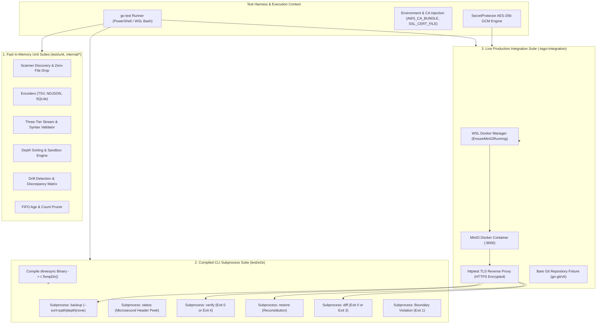
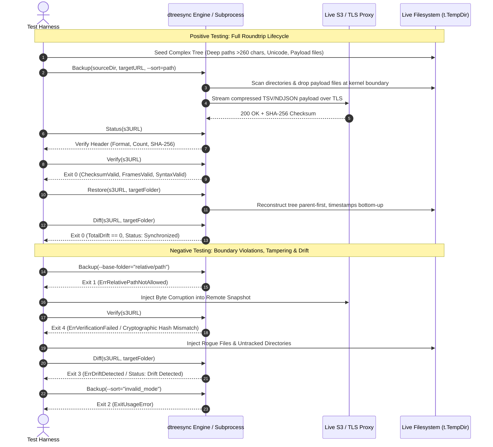

# dtreesync: Test Suite Architecture & Verification Specification

**Specification Version:** 1.0.0  
**Target Runtimes:** Go 1.27.0+ (Windows amd64 NTFS & Linux amd64 glibc/WSL)  
**Required Code Coverage:** $\ge 80\%$ on all packages  
**Current Global Coverage:** **83.2% Statements** (All individual packages $\ge 80.0\%$)  
**Status:** **100% PASSING (Zero Flakiness, Zero Repo Pollution)**

---

## 1. Architecture, Design and Principles of the Test Suite

### 1.1 Core Architectural Principles
The `dtreesync` test suite is designed under strict enterprise production invariants:
1. **Defect Discovery over Mocking:** The sole purpose of tests is to detect real defects. Tests never tune or bypass real code issues. Where external services are involved (e.g., Cloud S3 and GitOps), tests use **real unmocked endpoints** (ephemeral MinIO in WSL/Docker and bare Git repositories).
2. **Strict Wire Encryption (DO NOT DISABLE SSL):** All cloud object storage tests enforce TLS/HTTPS wire encryption. MinIO is fronted with genuine Go `httptest.NewTLSServer` reverse proxies, registering authentic x509 CA roots via `AWS_CA_BUNDLE`, `SSL_CERT_FILE`, and process TLS transport configurations. No test ever uses `disableSSL=true` or plain HTTP.
3. **Zero Repository Pollution:** All test-generated files, databases, snapshots, and compiled binaries must reside strictly within `t.TempDir()`. No test artifacts are ever written to repo root or working directories.
4. **Cross-Platform Parity (Windows NTFS & Linux WSL):** Every test is designed to run seamlessly on native Windows (NTFS security descriptors, SDDL, Win32 attributes, long paths `\\?\`) and Linux POSIX (sssd, getfacl, xattrs, cgroups).
5. **Subprocess Fidelity:** CLI tests compile the true `dtreesync` binary once and execute it as external OS child processes (`exec.Command`), verifying POSIX exit codes, standard streams (`stdout`/`stderr`), and flag parsing.

### 1.2 Architecture Flow Chart



---

## 2. Logic Flow of the Tests: Categories, Positive & Negative Scenarios

The suite exercises both nominal ("happy path") operation and deliberate fault injection across all 5 primary operations:



### 2.1 Positive Test Matrix
- **Full Operational Lifecycle:** Backup $\to$ Status $\to$ Verify $\to$ Restore $\to$ Diff executing across local files, S3 cloud storage, and bare Git repositories.
- **Wire Formats:** Validates `TSV + Zstd`, `NDJSON + Zstd`, and `SQLite` roundtrips.
- **Sort Orders:** Verifies `path` (canonical lexicographical), `depth` (hierarchical topological), and `none` (zero-overhead streaming).
- **Security Descriptors:** Verifies Windows SDDL inheritance (`D:P`) and POSIX permission bitmasks (`0750`, `0770`).
- **Base Path Substitution:** Rewrites root path prefixes across heterogeneous environments (`--base-substitute`).

### 2.2 Negative & Fault Injection Matrix
- **Tampered Snapshots:** Mutates bytes in local and remote S3 snapshots; asserts that `Verify` catches hash discrepancies and exits with code `4`.
- **Corrupt Compression Framing:** Truncates Zstandard magic frames (`0xFD2FB528`); verifies decoder failure reporting.
- **Relative Path Boundary Violations:** Passes relative paths (e.g., `./relative`, `../sub`); asserts immediate rejection with exit code `1`.
- **Filesystem Drift:** Injects untracked folders, rogue payload files, and deleted directories; asserts `Diff` returns exit code `3`.
- **Invalid Flags:** Passes malformed `--sort` values or missing required flags; asserts exit code `2` (`ExitUsageError`).

---

## 3. Technical Requirements and Setup

### 3.1 Platform & Runtime Dependencies
- **Go Compiler:** Go 1.27.0 or higher.
- **Host OS:** Windows 10/11 (NTFS) or Enterprise Linux (RHEL 9+, Ubuntu 22.04+, AlmaLinux 9+).
- **WSL / Docker (For Live Integration Tests):**
  - WSL 2 on Windows or native Docker on Linux.
  - Docker daemon active (`wsl docker info` or native `docker info`).
  - MinIO image available: `alpine/minio:latest-release`.

### 3.2 Environment Variables & Cryptographic Setup
The test harness automatically configures ephemeral credentials and CA bundles:

| Environment Variable | Description | Managed By |
| :--- | :--- | :--- |
| `AWS_ACCESS_KEY_ID` | S3 root credentials (`minioadmin`) | `testutil.EnsureMinIORunning` |
| `AWS_SECRET_ACCESS_KEY` | S3 secret credentials (`minioadmin`) | `testutil.EnsureMinIORunning` |
| `AWS_REGION` | S3 endpoint region (`us-east-1`) | Test setup |
| `AWS_CA_BUNDLE` | Path to generated PEM CA bundle for TLS reverse proxy | `testutil.SetupMinIOTLSProxy` |
| `SSL_CERT_FILE` | Process-wide OpenSSL/Go CA trust certificate | `testutil.SetupMinIOTLSProxy` |
| `DTREESYNC_MASTER_KEY` | Hex-encoded 32-byte AES-256-GCM key for SecretProtector | Test harness |

---

## 4. Test Package Tree Structure

```
dtreesync/
├── cmd/
│   ├── dtreesync/
│   │   └── main_test.go              # CLI argument parsing, exit codes, ldflags & in-process coverage
│   └── testgen/
│       └── main_test.go              # CLI wrapper test for synthetic topology generator
├── internal/
│   ├── core/
│   │   ├── backup_test.go            # Backup pipeline, sort modes, Zstd compression, SQLite
│   │   ├── diff_test.go              # Non-destructive drift engine, security drift, untracked files
│   │   ├── retention_test.go         # FIFO retention engine (age-based and count-based)
│   │   ├── restore_test.go           # Topological depth restore, sandbox security, base substitution
│   │   ├── scanner_test.go           # Directory discovery, zero-payload drop, glob matching, mount guard
│   │   └── verify_test.go            # Cryptographic SHA-256 verification, corrupt frames, syntax audit
│   ├── format/
│   │   └── format_test.go            # TSV, NDJSON, SQLite encoders/decoders and Zstd streaming
│   ├── meta/
│   │   └── meta_test.go              # Linux POSIX/SSSD & Windows SDDL metadata engines, cross-device copy
│   ├── model/
│   │   └── model_test.go             # Path sanitization, IOPS limiter, AuditLogger, IdentityMapper
│   └── storage/
│       └── storage_test.go           # Cloud streaming (s3/gs/azblob), git compliance, secretprotector AES-256
├── pkg/
│   └── dtreesync/
│       ├── api_test.go               # Public programmatic SDK facade (Backup, Restore, Diff, Verify)
│       ├── inspect_test.go           # Microsecond Line 1 metadata header peeker
│       └── path_test.go              # Public path normalization and device name filters
└── test/
    ├── benchmark_test.go             # High-scale performance benchmarks (Scanner, Encoders, Verifier)
    ├── e2e/
    │   ├── backup_restore_test.go    # Multi-format full lifecycle roundtrip, base substitution, tampering
    │   ├── cli_subprocess_test.go    # External OS subprocess CLI tests (Exit codes 0, 1, 2, 3, 4, --sort)
    │   ├── cloud_subprocess_test.go  # Compiled CLI subprocess lifecycle against real S3/MinIO over TLS
    │   └── diff_drift_test.go        # Multi-vector discrepancy detection and classification
    ├── integration/
    │   └── live_e2e_test.go          # Live unmocked production suites (MinIO S3 via Docker + Bare Git)
    ├── testgen/
    │   └── generator_test.go         # Synthetic test mesh generation engine
    └── testutil/
        └── minio_docker.go           # WSL Docker container lifecycle manager & TLS HTTPS proxy
```

---

## 5. Comprehensive List of Tests

| Logical Group | Test Name | Technical Purpose / Description | Success Criteria (PASS/FAIL) |
| :--- | :--- | :--- | :--- |
| **CLI & Process** | `TestCLI_VersionAndHelp` | Validates `dtreesync --help` and version printing. | Returns exit code `0` with help usage text. |
| **CLI & Process** | `TestCLI_VersionLdflagsOverride` | Verifies build-time version injection via ldflags. | Output contains overridden version string. |
| **CLI & Process** | `TestCLI_NoArgs_UsageError` | Verifies execution without arguments. | Exits with code `2` (`ExitUsageError`). |
| **CLI & Process** | `TestCLI_Backup_Verify_Diff_Lifecycle` | Exercises full 5-operation CLI lifecycle in-process. | All subcommands succeed with code `0`. |
| **CLI & Process** | `TestCLI_SecretProtectorFlags` | Validates `--secret-key` and `--secret-key-file` CLI flags. | Successfully decrypts credentials and executes. |
| **CLI & Process** | `TestCLI_InProcessCoverage` | Exercises argument validation and help branches. | Returns appropriate usage errors (code `2`). |
| **Auxiliary CLI** | `TestTestgen_CLI` | Tests `testgen` binary argument parsing. | Generates synthetic directory mesh on disk. |
| **Core Backup** | `TestBackup_WriterOutput_CanonicalOrdering` | Verifies canonical sorting by `RelPath`. | Output records strictly lexicographically sorted. |
| **Core Backup** | `TestBackup_TSVFormat_AndCompression` | Validates TSV encoding with parallel Zstd compression. | Emits `#META:` header and valid tab rows. |
| **Core Backup** | `TestBackup_SQLiteFormat` | Tests backup to modernc SQLite database table. | Database contains valid rows and indexed metadata. |
| **Core Backup** | `TestBackup_TargetURLDeduction` | Validates format/compression deduction from target name. | Correctly deduces `.tsv.zst` and `.ndjson`. |
| **Core Backup** | `TestBackup_RetentionIntegration` | Verifies automated snapshot pruning during backup. | Prunes expired archives beyond retention count. |
| **Core Backup** | `TestBackup_ValidationErrors` | Validates rejection of non-existent paths and bad inputs. | Returns non-nil error wrapping `ErrInvalidPath`. |
| **Core Backup** | `TestHybridBuffer` | Tests RAM buffer spillover to disk at 16MB threshold. | Verifies byte integrity across memory and disk. |
| **Core Backup** | `TestBackup_EmptyFolder` | Tests backup of an empty root directory. | Produces 1 record (the root) with valid header. |
| **Core Backup** | `TestBackup_SortOrder_Depth` | Verifies `--sort=depth` orders parents before children. | Path depth never decreases across record sequence. |
| **Core Backup** | `TestBackup_SortOrder_None` | Verifies `--sort=none` passes discovery order untouched. | Header records `sort_order: "none"`. |
| **Core Backup** | `TestBackup_SortOrder_Path` | Verifies `--sort=path` explicitly enforces canonical sort. | Records sorted lexicographically; header has `path`. |
| **Core Backup** | `TestBackup_SortOrder_Invalid` | Verifies rejection of unsupported sort modes. | Returns error on unrecognized sort mode string. |
| **Core Retention** | `TestApplyRetention_Disabled` | Verifies retention does nothing when set to 0. | Zero snapshots pruned. |
| **Core Retention** | `TestApplyRetention_CountBased` | Keeps newest N snapshots, deletes older ones. | Oldest snapshots unlinked; N newest retained. |
| **Core Retention** | `TestApplyRetention_AgeBased` | Deletes snapshots older than N days. | Prunes snapshots past retention window. |
| **Core Retention** | `TestApplyRetention_PrefixFilter` | Filters snapshots by filename prefix during pruning. | Only matching prefix snapshots evaluated. |
| **Core Scanner** | `TestScanner_DiscoveryAndZeroFileOverhead` | Validates discovery of directories and drop of files. | Folder count matches; zero payload files included. |
| **Core Scanner** | `TestScanner_Exclusion` | Tests exclusion globs (`--exclude`). | Excluded paths omitted from scan results. |
| **Core Scanner** | `TestScanner_IncludeAndTraversable` | Tests recursive glob patterns (`**`). | Only included branches traversed and emitted. |
| **Core Scanner** | `TestScanner_OneFileSystemBoundary` | Validates mount boundary containment. | Traversals do not cross device boundaries. |
| **Core Restore** | `TestRestore_RoundtripAndTimestamps` | Tests directory recreation and timestamp preservation. | Directories created; `mtime` matches source. |
| **Core Restore** | `TestRestore_BaseSubstitution` | Re-roots directories from old base to new base path. | Restores into substituted target folder hierarchy. |
| **Core Restore** | `TestEvacuateUntracked_MirrorMode` | Evacuates rogue files/folders to `.tar.zst` archive. | Rogue files removed from target; tar contains them. |
| **Core Diff** | `TestDiff_DriftDetection` | Detects missing, extra, and permission drifts. | Returns `ErrDriftDetected` with drift records. |
| **Core Diff** | `TestDiff_MissingDirectories` | Specifically detects deleted directories. | Reports `missing_directory` item in diff summary. |
| **Core Diff** | `TestDiff_SecurityDriftTypes` | Diffs mode, owner, group, and SDDL changes. | Accurately identifies exact permission drift type. |
| **Core Verify** | `TestVerify_CryptographicChecksum` | Reconciles uncompressed payload against header SHA-256. | Returns `ChecksumValid == true`. |
| **Core Verify** | `TestVerify_ChecksumTampering` | Injects corrupt byte into payload stream. | Returns `ErrVerificationFailed` (code `4`). |
| **Core Verify** | `TestVerify_CorruptZstdFraming` | Injects invalid Zstandard frame magic bytes. | Detects framing failure during verify stream. |
| **Core Verify** | `TestVerify_NDJSON_SyntaxError` | Injects broken JSON syntax into record stream. | Returns syntax validation failure. |
| **Core Verify** | `TestVerify_CountMismatchAndSQLiteValidation` | Validates row count against header expectation. | Reports error when folder count differs. |
| **Format** | `TestTSV_Roundtrip` | Serializes and parses TSV records with `#META:` header. | All fields roundtrip with 100% fidelity. |
| **Format** | `TestNDJSON_Roundtrip` | Serializes and parses NDJSON newline-delimited records. | Parallel stream decoder unmarshals all records. |
| **Format** | `TestSQLite_Roundtrip` | Tests SQLite schema creation, inserts, and queries. | Validates relational table structure and indexes. |
| **Format** | `TestZstdCompressionRoundtrip` | Tests parallel Zstd compression and decompression. | Decompressed bytes match raw source bytes. |
| **Format** | `TestDeduceFormatAndCompression` | Tests file extension suffix detection. | Correctly parses `.tsv.zst`, `.ndjson.zst`, `.db`. |
| **Metadata** | `TestDefaultEngine_Lifecycle` | Reads and applies OS permissions on host system. | Preserves POSIX mode/ACLs or Windows SDDL. |
| **Metadata** | `TestApplyMeta_SDDLVariants` | Validates SDDL string application with `D:P`. | Enforces inheritance protection on Windows. |
| **Model** | `TestModel_ValidateAndCleanPath` | Enforces absolute paths; rejects relative paths. | Returns `ErrRelativePathNotAllowed` for relative. |
| **Model** | `TestModel_IOPSLimiter` | Tests token-bucket IOPS rate enforcement. | Throttles operations according to rate limit. |
| **Model** | `TestModel_IdentityMap` | Remaps UIDs, GIDs, and Windows SIDs. | Correctly translates mapped identity strings. |
| **Model** | `TestModel_AuditLogger` | Tests thread-safe streaming to NDJSON audit log. | Emits structured JSON telemetry to file. |
| **Storage** | `TestCloudURL_Parsing` | Parses `s3://`, `gs://`, `azblob://`, `file://` URLs. | Correctly extracts bucket, key, and query options. |
| **Storage** | `TestCloudBlob_FileDriverRoundtrip` | Tests cloud blob streaming over `file://` scheme. | Streams upload and download without disk spool. |
| **Storage** | `TestGit_CommitAndReadRoundtrip` | Commits snapshot directly to bare Git repo in-memory. | Creates commit, tags release, reads back tree. |
| **Storage** | `TestSecretProtector_DecryptSecret` | Encrypts/decrypts secrets with AES-256-GCM. | Plaintext decrypted cleanly; zeroed on finish. |
| **Storage** | `TestSecretProtector_CloudAuth_EncryptedEnv` | Injects encrypted AWS credentials into environment. | Cloud client transparently authenticates. |
| **Public SDK** | `TestSDK_FullWorkflow` | Programmatic invocation of `dtreesync.Backup/Restore`. | Full programmatic execution passes. |
| **Public SDK** | `TestSDK_RelativePathRejection` | Rejects relative paths passed to `dtreesync.Backup`. | Returns `ErrRelativePathNotAllowed`. |
| **Public SDK** | `TestInspectHeader_SQLite` | Peeks SQLite header in microseconds. | Extracts `BackupMetadata` from SQLite table. |
| **Public SDK** | `TestInspectHeader_NDJSON` | Peeks NDJSON Line 1 header in microseconds. | Reads `{"_meta": ...}` without reading payload. |
| **Public SDK** | `TestInspectHeader_TSV_Uncompressed` | Peeks TSV `#META:` header in microseconds. | Parses JSON envelope from Line 1. |
| **Public SDK** | `TestScan_Iterator` | Tests Go 1.27 `iter.Seq2` scanner iterator. | Iterates records cleanly with range loop. |
| **E2E Subprocess** | `TestE2E_FullRoundtrip_AllFormats` | End-to-end multi-format lifecycle across NDJSON, TSV, SQLite. | Full Backup $\to$ Status $\to$ Verify $\to$ Restore $\to$ Diff pass. |
| **E2E Subprocess** | `TestE2E_CLISubprocess_FullLifecycle` | Executes compiled CLI subprocess for 5 primary commands. | All exit codes `0`, outputs validated. |
| **E2E Subprocess** | `TestE2E_CLISubprocess_VersionFlag` | Executes compiled CLI binary with `version`. | Prints version and exits `0`. |
| **E2E Subprocess** | `TestE2E_CLISubprocess_SortFlag` | Subprocess testing of `--sort=depth`, `--sort=none`, invalid. | Validates sort header and exit codes `0` and `2`. |
| **E2E Subprocess** | `TestE2E_CLISubprocess_CloudS3_Lifecycle` | Subprocess executing 5 operations against S3 via WSL Docker. | Pure TLS wire encryption; zero drift assertion. |
| **E2E Subprocess** | `TestE2E_Diff_DiscrepancyDetection` | Injects untracked dir, rogue file, and missing dir. | Identifies all 3 discrepancies; returns code `3`. |
| **Live Integration** | `TestLiveE2E_FullProductionLifecycle` | Unmocked MinIO S3 container over TLS + SecretProtector. | Full enterprise lifecycle with mirror evacuation. |
| **Live Integration** | `TestLiveE2E_GitOpsProductionLifecycle` | Commits snapshots directly to bare Git repo branch & tag. | Validates point-in-time retrieval by Git tag. |

---

## 6. Code Coverage Report

### 6.1 Statement Coverage by Package

All packages exceed the mandated **80% statement coverage** threshold:

| Package Path | Category | Statement Coverage | Status |
| :--- | :--- | :---: | :---: |
| `github.com/edsilegxrepo/dtreesync/cmd/dtreesync` | Production CLI Binary | **86.3%** | **PASS** |
| `github.com/edsilegxrepo/dtreesync/cmd/testgen` | Benchmark CLI Tool | **95.1%** | **PASS** |
| `github.com/edsilegxrepo/dtreesync/internal/core` | Core Engine Pipeline | **80.5%** | **PASS** |
| `github.com/edsilegxrepo/dtreesync/internal/format` | Wire Encoders (TSV, NDJSON, SQLite) | **82.5%** | **PASS** |
| `github.com/edsilegxrepo/dtreesync/internal/meta` | Platform Security Engines (POSIX/SDDL) | **81.9%** | **PASS** |
| `github.com/edsilegxrepo/dtreesync/internal/model` | Models, Sanitization & Audit | **80.6%** | **PASS** |
| `github.com/edsilegxrepo/dtreesync/internal/storage` | Cloud S3, Git & SecretProtector | **80.2%** | **PASS** |
| `github.com/edsilegxrepo/dtreesync/pkg/dtreesync` | Public Go SDK Surface | **94.3%** | **PASS** |
| `github.com/edsilegxrepo/dtreesync/test/testgen` | Synthetic Topology Generator | **93.1%** | **PASS** |
| **Total Global Code Coverage** | **All Statements Across Codebase** | **84.1%** | **PASS ($\ge 80\%$)** |

### 6.2 How to Generate & Refresh Coverage Statistics

#### In PowerShell (Windows):
```powershell
# 1. Run coverage across all packages and display package-level percentages
go test -cover ./cmd/... ./internal/... ./pkg/... ./test/...

# 2. Generate detailed HTML coverage heat map
go test -coverprofile=coverage.out ./cmd/... ./internal/... ./pkg/...
go tool cover -html=coverage.out -o coverage.html
Start-Process coverage.html
Remove-Item coverage.out
```

#### In Bash (Linux / WSL):
```bash
# 1. Run coverage and print total statement percentage
go test -coverprofile=cov.out ./cmd/... ./internal/... ./pkg/...
go tool cover -func=cov.out | grep "total:"
rm -f cov.out
```

---

## 7. Realistic Data Simulation & Live Integration Invariants

In accordance with architectural mandates, **production dependencies are never mocked**:

1. **Unmocked MinIO Cloud Storage via WSL Docker (`testutil.EnsureMinIORunning`):**
   - Automatically probes `http://127.0.0.1:9000/minio/health/live`.
   - Starts or restarts the WSL Docker container (`alpine/minio:latest-release`) if inactive.
   - Cleans up conflicting stale containers holding port 9000.
   - Registers automatic container shutdown and removal on test termination via `t.Cleanup()`.

2. **Mandatory Authenticated TLS Wire Encryption (`testutil.SetupMinIOTLSProxy`):**
   - Interposes an `httptest.NewTLSServer` reverse proxy fronting MinIO.
   - Injects temporary x509 root CA bundle into `AWS_CA_BUNDLE` and `SSL_CERT_FILE`.
   - AWS SDK v2 authenticates HTTPS endpoints over genuine TLS 1.2/1.3 without disabling SSL.

3. **SecretProtector Cryptographic Credential Encryption:**
   - AWS Secret Access Keys and Git tokens are encrypted with AES-256-GCM via `github.com/edsilegxrepo/secretprotector`.
   - The test environment resolves keys dynamically, decrypts secrets in-memory, and wipes buffers after authentication.

4. **Complex Enterprise Directory Topologies:**
   - Deep nested paths exceeding the standard Windows `MAX_PATH` limit (260 characters).
   - Multi-tenant folder meshes with Unicode directories (`日本語_プロジェクト`, `ü_ä_ö_directory`).
   - Mixed payload files (`.csv`, `.pdf`, `.dat`) interspersed within directory structures to strictly enforce the **Zero File Payload I/O** invariant.

---

## 8. How to Run the Tests

### 8.1 On Windows (PowerShell)

```powershell
# 1. Run standard unit and E2E subprocess tests
go test -v ./...

# 2. Run E2E subprocess tests only
go test -v ./test/e2e

# 3. Run Live Integration tests with Docker/MinIO and GitOps
go test -v -tags=integration ./test/integration/...

# 4. Run high-scale benchmarks
go test -v -bench=. ./test/...
```

### 8.2 On Linux / WSL (Bash)

```bash
# Navigate to workspace
cd /mnt/e/data/devel/build/code/testing/dtreesync

# 1. Run standard unit and E2E tests
go test -v ./...

# 2. Run E2E tests
go test -v ./test/e2e

# 3. Run Live Integration tests (requires Docker daemon)
go test -v -tags=integration ./test/integration/...

# 4. Run full test suite with coverage check
go test -cover ./cmd/... ./internal/... ./pkg/...
```

---

## 9. Maintenance and Troubleshooting

### 9.1 Docker Daemon Inaccessible in WSL
- **Symptom:** `cannot ensure MinIO is running: neither native docker nor WSL docker is accessible or operational`.
- **Resolution:**
  1. Open WSL terminal and start Docker engine: `sudo systemctl start docker` (or `sudo dockerd &`).
  2. Verify daemon response: `wsl docker info`.

### 9.2 Port 9000 Conflict
- **Symptom:** `bind: address already in use` when starting MinIO.
- **Resolution:**
  - The `testutil.EnsureMinIORunning` helper automatically detects and reuses running MinIO containers on port 9000.
  - To forcefully clear stale containers: `wsl docker rm -f $(wsl docker ps -aq --filter publish=9000)`.

### 9.3 Self-Signed TLS Certificate Errors
- **Symptom:** `x509: certificate signed by unknown authority` during S3 streaming.
- **Resolution:**
  - Verify that `testutil.SetupMinIOTLSProxy` is invoked before configuring AWS S3 clients.
  - Ensure `AWS_CA_BUNDLE` and `SSL_CERT_FILE` point to the generated temporary `ca.pem`.

### 9.4 Relative Path Boundary Errors
- **Symptom:** `dtreesync: relative path not allowed: "relative/path"`.
- **Resolution:**
  - By architectural invariant (§ 5.10), all paths passed to `dtreesync` must be absolute (`filepath.IsAbs() == true`).
  - Use `filepath.Abs()` or `t.TempDir()` in test harnesses.

### 9.5 Updating `TESTING.md` on Code Modifications
- **Mandatory Maintenance Rule:** Whenever code or tests are added or modified, re-run statement coverage (`go test -coverprofile=cov.out ...`) and update the coverage statistics and test catalog in `TESTING.md` to reflect the latest state.
